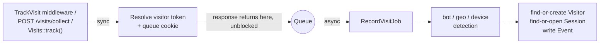

# Laravel Visits

[](https://packagist.org/packages/fomvasss/laravel-visits)
[](https://packagist.org/packages/fomvasss/laravel-visits)
[](https://packagist.org/packages/fomvasss/laravel-visits)

A self-hosted, first-party analytics platform for Laravel — not just pageview logging: visitor/session/event tracking, geo/device/bot detection, campaign attribution, conversions tied directly to your own Eloquent models, rollup analytics, and a full dashboard with a live activity map — all in your own database.

[Українська документація](README.uk.md)


## Contents

- [Features](#features)
- [Requirements](#requirements)
- [Installation](#installation)
- [Quick Start](#quick-start)
- [How It Works](#how-it-works)
- [Tracking](#tracking)
  - [Automatic page views](#automatic-page-views)
  - [Custom actions (server-side)](#custom-actions-server-side)
  - [JS beacon](#js-beacon)
  - [Identity resolution](#identity-resolution)
  - [Identifying a visitor without a real login](#identifying-a-visitor-without-a-real-login)
- [Tracking Params](#tracking-params)
- [Geo & Device Detection](#geo--device-detection)
  - [Using the MaxMind driver](#using-the-maxmind-driver)
- [Consent (GDPR)](#consent-gdpr)
- [Multi-Tenancy](#multi-tenancy)
- [Overriding Models](#overriding-models)
- [Events](#events)
- [Whoami Endpoint](#whoami-endpoint)
- [Dashboard](#dashboard)
  - [Live Activity Page](#live-activity-page)
- [Console Commands](#console-commands)
  - [Scheduling](#scheduling)
- [Configuration](#configuration)
- [When to Use This (vs GA4, Plausible, Matomo)](#when-to-use-this-vs-ga4-plausible-matomo)
- [Security Considerations](#security-considerations)
- [Testing](#testing)
- [Support](#support)
- [License](#license)

## Features

- **Three-tier data model** — Visitor (durable, cross-session identity) → Session (one browsing session) → Event (page view or custom action), instead of one flat "visits" table.
- **Async-first** — the middleware/endpoint only resolves the visitor token and queues a job; all the expensive work (geo lookup, device/bot detection, DB writes) happens off the request/response cycle.
- **Cookie + client-token identity** — a long-lived cookie for plain browser traffic, with a client-supplied token (header or `localStorage`) taking priority for cross-origin SPAs and native/mobile clients where cookies are unreliable.
- **Geo, device & bot detection** — via `stevebauman/location` and `matomo/device-detector`.
- **Campaign attribution** — UTM/`ref` parameters (first-touch on Visitor, last-touch on Session), plus a generic `extra_params` JSON bucket for ad-platform click IDs (`gclid`, `fbclid`, `msclkid`, ...).
- **Custom conversion events** — `Visits::track('order.placed', $order, ['amount' => 100])`, optionally tied to any Eloquent model via a polymorphic relation.
- **Rollup analytics** — a scheduled command pre-aggregates daily stats per metric/dimension, so the dashboard never scans raw event tables.
- **Built-in dashboard** — Overview (with a session-locations map), Campaigns, Sessions, Visitors, per-session/visitor detail, a Live activity page (polling or Server-Sent Events), and a public Whoami page.
- **Public Whoami endpoint** — an `ifconfig.me`-style JSON endpoint (IP/geo/device/UTM detection), read-only, no cookie set — usable standalone by other services.
- **Multi-tenant friendly** — a generic `tenant_id` column and per-model override hooks, without the package imposing any particular tenancy package.
- **Model overrides** — every relation and write path resolves models through config, so subclassing `Visitor`/`Session`/`Event`/`StatDaily` (extra scopes, relations, casts) is picked up everywhere automatically.
- **GDPR-friendly consent hook** — an optional resolver interface gates tracking until consent is confirmed.

## Requirements

- PHP ^8.3
- Laravel ^12.0 or ^13.0
- A configured queue connection (tracking is dispatched to a queue by default — see the `queue` key in [Configuration](#configuration))

## Installation

```bash
composer require fomvasss/laravel-visits
php artisan migrate
```

The service provider is auto-discovered. The tracking middleware is pushed onto the `web` group automatically — no manual registration needed.

Publish the config file to customize anything (cookie name, rate limits, excluded paths, dashboard path/middleware, live page transport, ...):

```bash
php artisan vendor:publish --tag=visits-config
```

Optionally publish the JS beacon (only needed for SPA route tracking or client-side custom events — see [JS Beacon](#js-beacon)):

```bash
php artisan vendor:publish --tag=visits-assets
```

## Quick Start

That's it for automatic page-view tracking — every `GET` request through the `web` middleware group is now tracked. Visit `/visits` to see the dashboard.

To track a custom conversion from server-side code:

```php
use Fomvasss\Visits\Facades\Visits;

Visits::track('order.placed', $order, ['amount' => $order->total]);
```

To check what the package currently detects about a request, without tracking anything:

```php
Visits::whoami(); // ['ip' => ..., 'geo' => ..., 'device' => ..., 'tracking_params' => ...]
```

or hit the public JSON endpoint at `GET /visits/whoami`.

## How It Works

```
Visitor  (one row per browser/device, ever — durable identity)
  └─ Session  (one row per browsing session, closed after inactivity)
       └─ Event  (one row per page view or custom action)
```

A request comes in through the `TrackVisit` middleware (or `POST /visits/collect`, or `Visits::track()`). Only the visitor token is resolved and the cookie queued synchronously — everything else (bot/geo/device detection, finding-or-creating the `Visitor`, finding-or-opening the `Session`, writing the `Event`) happens in `RecordVisitJob`, dispatched to the queue configured under `visits.queue`. A stale (past `session_timeout_minutes`) session is closed by the `visits:close-stale-sessions` command, not by the request that would otherwise start a new one.



For a deeper, contributor-level look — the exact `RecordVisitJob` sequence, what differs between the three entry points, the data model, and every Support class's single responsibility — see [`docs/architecture.md`](docs/architecture.md).

## Tracking

Which mechanism to use depends on what kind of app is on the other end:

- **A Blade/server-rendered site** — use the `TrackVisit` middleware ([below](#automatic-page-views)). It's automatic: every `GET` is a full page load, so there's a real server request to hang tracking off of, no extra code needed.
- **An API backend behind a SPA or mobile app** — the middleware doesn't apply. A `GET` to an API endpoint (`GET /api/products`) is a data fetch, not a page view, and typically lives under the `api` middleware group anyway, which `TrackVisit` never touches. Track page views explicitly instead: the [JS beacon](#js-beacon) (`Visits.trackPageView()`) on route change for a SPA, or a direct `POST /visits/collect` call for a mobile app (see [`docs/client-integration.md`](docs/client-integration.md)).
- **Custom actions/conversions, on any of the above** — always [`Visits::track()`](#custom-actions-server-side), called from wherever the business event actually happens server-side (a controller, a job, a webhook handler) — regardless of whether the request that triggered it was a Blade form post, an API call, or a queued job with no request at all.

### Automatic page views

Any `GET` request through the `web` middleware group is tracked automatically, except paths matching `visits.exclude_paths` (admin/debugbar/horizon/health-check paths are excluded by default) — and the package's own dashboard/whoami paths, which are always excluded regardless of `exclude_paths` (otherwise browsing `/visits` would itself generate page-view rows about viewing the dashboard).

Set `visits.auto_track` to `false` to flip this from a denylist to an allowlist: `TrackVisit` is no longer pushed onto the `web` group automatically, and `exclude_paths` no longer applies (nothing to exclude from). It's still registered under the `track-visits` alias, so attach it to only the routes you actually want tracked:

```php
Route::middleware(['web', 'track-visits'])->group(function () {
    // only these routes generate page views
});
```

`visits.exclude_ips` (literal IPs and/or CIDR ranges — an internal/office network, for example) is checked centrally in `RecordVisitJob` instead, so it applies to every entry point uniformly — the automatic middleware, `POST /visits/collect`, and server-side `Visits::track()` calls alike.

Set `visits.page_views` to `'first_only'` if you only care about attribution (referrer/UTM/geo/device, captured once) plus your own explicit `Visits::track()` calls (login, purchase, ...) — not a full page-view trail. `TrackVisit` still runs on every request (cookie renewal, `Session`/`Visitor` freshness), it just skips writing an `Event` row once the visitor already has the cookie. The effect is the same as bolting on a custom "only track brand-new visitors" middleware, without writing one. `Session.page_views_count` stays at 0 or 1 in this mode, and the dashboard's Top Pages/Live feed will be correspondingly sparse — expected, not a bug.

### Custom actions (server-side)

```php
use Fomvasss\Visits\Facades\Visits;

// simple action, no related model
Visits::track('newsletter.subscribed');

// tied to an Eloquent model (writes eventable_type/eventable_id), with extra metadata
Visits::track('order.placed', $order, ['amount' => $order->total, 'currency' => 'USD']);
```

This goes through the same async pipeline as page views, attaches to whichever `Session` is currently open for the resolved visitor token, and fires [`VisitRecorded`](#events) (and [`ConversionRecorded`](#events) when an `$eventable` is passed).

#### Example: page visit → order placed → payment confirmed

A typical e-commerce funnel, spanning three different request contexts:

```php
// 1. Product/catalog page — nothing to write, TrackVisit handles it automatically
//    (assuming auto_track is on and the route isn't in exclude_paths).

// 2. Checkout submitted — a real browser request, so the current cookie/header
//    already resolves the right visitor. No special handling needed.
Visits::track('order.placed', $order, ['amount' => $order->total]);

// 3. Payment gateway webhook, minutes/hours/days later — a server-to-server
//    call with no cookie, no header: nothing here identifies the customer.
//    inheritFrom looks up the visitor from the 'order.placed' event already
//    recorded on this same $order (via HasVisits — see below), instead of
//    misattributing this event to a brand-new "visitor" (the payment gateway).
Visits::track('order.paid', $order, ['amount' => $order->total], inheritFrom: 'order.placed');
```

`inheritFrom` only kicks in when the current request carries **no** identity signal of its own (no header, no cookie) — a live browser request (e.g. a "thank you" redirect page after payment) is still trusted over inherited history, since that's a real, current visitor. If `$order` has no `'order.placed'` event to inherit from (the feature was added after this order was placed, for example), it falls back to generating a fresh token, same as any other never-seen visitor — not an error.

**JS variant of step 3**, if the payment gateway redirects the browser back to a "thank you" page instead of (or alongside) a server-to-server webhook — that page is a real, live visit, so it already carries the visitor's own cookie/`localStorage` token; no `inheritFrom` needed at all:

```js
Visits.track('order.paid', { order_id: {{ $order->id }}, amount: {{ $order->total }} });
```

Two things this loses compared to the server-side call above: it can't attach `eventable` (`POST /visits/collect` has no such field — pass whatever identifies the order into `meta` instead, as shown), and it depends on the browser actually reaching that page (closed tab, blocked script, abandoned redirect all mean it never fires). Treat it as a redundant/earlier signal, not a replacement for the webhook — the webhook is what a payment gateway guarantees will fire; the browser redirect isn't guaranteed at all.

### JS beacon

For SPA route changes and client-side custom events the server-side middleware can't see. No build step — include it directly, or via `vendor:publish --tag=visits-assets`:

```html
<script>
  window.VisitsConfig = { endpoint: '/visits/collect', autoTrackPageView: true };
</script>
<script src="/vendor/visits/visits.js"></script>
```

```js
Visits.trackPageView(); // call manually on SPA route changes if autoTrackPageView is off
Visits.track('newsletter.subscribed', { plan: 'pro' });
```

The beacon persists `visitor_id` in `localStorage` (falling back silently if unavailable) and sends it as `X-Visitor-Id`, which takes priority over the cookie server-side — this is what makes it work across origins where cookies aren't reliable.

If you'd rather queue calls the way GTM's `dataLayer` works (e.g. loading `visits.js` with `async`, or firing events from an inline `<script>` earlier in `<head>` before the beacon has necessarily run yet), push array-form calls to `window.VisitsQueue` instead — safe before *or* after the script has loaded:

```html
<script>
  window.VisitsQueue = window.VisitsQueue || [];
  window.VisitsQueue.push(['trackPageView']);
  window.VisitsQueue.push(['track', 'newsletter.subscribed', { plan: 'pro' }]);
</script>
<script src="/vendor/visits/visits.js" async></script>
```

### Beyond a same-origin Blade app

The beacon is optional — `POST /visits/collect` is a plain JSON endpoint, callable directly with any HTTP client. For an API-only backend, a decoupled SPA/mobile app, a backend serving both a web app and an API, or a frontend on a different domain than the API — see [`docs/client-integration.md`](docs/client-integration.md) for what to replicate yourself and the config/CORS/CSRF specifics each of those needs.

### Identity resolution

Precedence when resolving the visitor's token on each request: client-supplied token (`X-Visitor-Id` header or `visitor_id` input) → existing cookie → `Visits::track()`'s `inheritFrom`, if given → the authenticated request's own known `Visitor`, if any → freshly generated. The cookie (`visits.cookie.name`, 2-year TTL by default) is (re-)queued on every tracked request regardless of which path resolved the token.

**The authenticated-user fallback matters for Bearer-token APIs specifically.** A cookie only round-trips when the browser is willing to send it back — same-origin always, cross-origin only with `credentials: include` *and* the API's CORS config allowing credentials (`supports_credentials: true`, a non-wildcard origin). A typical Sanctum personal-access-token API (`Authorization: Bearer ...`, no CORS credentials) never gets the visits cookie back at all — without this fallback, every server-side `Visits::track()` call for an already-known, logged-in user (a purchase, a profile update) would otherwise spawn a brand-new, disconnected anonymous `Visitor` instead of reconnecting to theirs. If your auth model uses [`HasVisits`](#attaching-visits-to-your-own-models), this happens automatically — no extra code, no new parameter. Only the very first anonymous touchpoint (before any `Visitor` is linked to that user at all) can't be reconnected this way, same as any attribution system.

### Identifying a visitor without a real login

`Visits::identify($user)` links the current request's `Visitor` to `$user` — the same merge `MergeVisitorIdentity` performs on Laravel's own `Login` event, but for identity established *without* an actual authentication happening. The recurring case: guest checkout, where a phone/email typed into a form matches or creates a `User` record with no password, OTP, or session involved at all.

```php
// e.g. inside a guest checkout action, right after the guest User is matched/created
Visits::identify($user);
```

**Don't reach for this by dispatching a fake `Login` event instead** (`event(new \Illuminate\Auth\Events\Login(...))`) — it's tempting since that's exactly what `MergeVisitorIdentity` listens for, but it's misleading to any *other* `Login` listener a host app adds later (a "new sign-in" security notification, a fraud check, a failed-attempt-counter reset, ...): those would fire on a form submission that was never actually a login. `Visits::identify()` does the identical merge — same-request token resolution, `Visitor.user_id`/`user_type` update, `VisitorIdentified` dispatch, immutable `Session` snapshot if still open within `session_timeout_minutes` — without touching the `Login` event at all. Reserve dispatching `Login` itself for cases where a real authentication happened through a code path that just doesn't call `Auth::login()`/`Auth::attempt()` (a Sanctum token issued directly after verifying a password/OTP, for example) — there, it's accurate, not borrowed.

### Attaching visits to your own models

Add the `HasVisits` trait to any model you call `Visits::track($name, $model)` against (`Order`, `Lead`, a `User`, ...):

```php
use Fomvasss\Visits\Concerns\HasVisits;

class Order extends Model
{
    use HasVisits;
}

$order->visitEvents; // every Event tied to this model via eventable
$order->latestVisitEvent('order.shipped')->first(); // latest Event with this name, or null
$order->firstVisitEvent('order.placed')->first(); // earliest Event with this name, or null
```

#### Reading data back from an eventable model (e.g. `Order`)

Each `Event` carries its own `visitor`/`session`, so you can go from a business record straight to *how* and *from where* it happened, not just *that* it happened:

```php
$event = $order->latestVisitEvent('order.placed')->first();

$event->meta;                 // ['amount' => 100, 'currency' => 'USD'] — whatever you passed to Visits::track()
$event->visitor;              // Visitor — the durable identity, across every session they've ever had
$event->session;              // Session — specifically the browsing session this order happened in
$event->session->utm_source;  // attribution for THIS order specifically (last-touch on Session)
$event->session->country_code; // geo at the moment of this order
$event->session->device_type;  // device used to place it

// Every stage of this order's funnel, if you track more than one name against it
$order->visitEvents()->pluck('name', 'created_at'); // e.g. ['order.placed' => ..., 'order.paid' => ..., 'order.shipped' => ...]
$order->latestVisitEvent('order.paid')->first();
```

#### Reading data back from your auth model (e.g. `User`)

On a `User` model (or whatever your auth model is), the same trait also exposes:

```php
$user->visitorProfiles; // every Visitor ever linked to this user across all their devices/browsers

$user->visitorProfiles->count();                    // how many distinct devices/browsers they've used while logged in
$user->firstVisitorProfile;   // the device/browser they first ever showed up on, by first_seen_at
$user->latestVisitorProfile;  // their most recently active device/browser, by last_seen_at
$user->visitorProfiles->pluck('utm_source', 'id');  // first-touch acquisition channel per device

// every Event across every device this user has ever used, e.g. all their conversions
$user->visitorProfiles->flatMap->events;
$user->visitorProfiles->flatMap->events->where('type', \Fomvasss\Visits\Models\Event::TYPE_ACTION);
```

`firstVisitorProfile`/`latestVisitorProfile` are `ofMany()` relations (like `latestVisitEvent`), so they resolve in a single query and are eager-loadable — no need to pull every `Visitor` row into PHP just to pick one.

Each `Visitor` also exposes the same first/last pair one level down, over its own `Session` rows:

```php
$user->latestVisitorProfile->firstSession;   // that device's very first Session (immutable snapshot: ip, geo, device at the time)
$user->latestVisitorProfile->latestSession;  // that device's most recent Session
```

A `Visitor` only links to a `User` from the moment they logged in on that device (see [`VisitorIdentified`](#events), fired on Laravel's own `Login` event) — anonymous browsing before that first login on a given device is still there on the `Visitor`/`Session` rows, just not reachable through `$user->visitorProfiles` until the link exists.

## Tracking Params

Query parameters are split three ways (`config('visits.tracking_params')`):

- **core** — `utm_source`, `utm_medium`, `utm_campaign`, `utm_term`, `utm_content`, `ref`. Real, indexed columns. First-touch (written once) on `Visitor`, last-touch (overwritten when present, otherwise inherited) on `Session`.
- **extra_keys** — always captured into the `extra_params` JSON bucket: ad-platform click IDs (`gclid`, `fbclid`, `msclkid`, `ttclid`, `yclid`, `twclid`, `li_fat_id` by default) — high-cardinality, not worth a dedicated column each, but worth keeping so you can send the ID back to that platform's own conversion API.
- **extra_pattern** — an optional regex; any other query param whose *name* matches it is also captured into `extra_params`. `null` by default. Example: `'/^aff_/'` captures every `aff_*` param from an affiliate network of your own.

Separately, `config('visits.search_engines')` extracts the organic search keyword from a known search engine's *referrer* URL (not the current request's own query string, which is why it's not part of `tracking_params` above) into `Visitor.search_term`/`Session.search_term` — same first-touch/last-touch split as UTM. Most search engines stop sending a real referrer over HTTPS-to-HTTPS navigation ("keyword not provided"); this only catches the cases where one still arrives.

## Geo & Device Detection

Geo lookups go through `stevebauman/location` (configure its driver in your own `config/location.php`); results are cached per IP for `visits.geo.cache_ttl` seconds. Set `visits.geo.store_coordinates` to `false` to skip storing `lat`/`lng` for privacy-conscious deployments.

Device/browser/platform detection and bot classification go through `matomo/device-detector`, which compiles its rule set on first use and caches it under `visits.device_detection.cache_dir`. Bot traffic never pays for a geo lookup (checked first), and dashboard queries exclude bots by default (see `ExcludesBotsByDefault` — use `withBots()`/`onlyBots()` to opt back in on any query).

Both are stored on `Visitor` **and** `Session`, but with different semantics — `Visitor`'s copy is the *last-known* value (mutable, overwritten on every new session), `Session`'s is an *immutable snapshot* of what was detected at the time that specific session started. Same core-columns-vs-JSON-bucket split as [Tracking Params](#tracking-params) above: dimension-worthy fields get a real, indexed column; everything else (inconsistent across drivers, high-cardinality, or just rarely queried) goes into a `geo_meta`/`device_meta` JSON bucket instead of a dedicated column each.

**Geo — core columns:** `country_code`, `region`, `city`, `timezone`, `lat`/`lng` (unless `store_coordinates` is `false`). **`geo_meta` JSON:** `country_name`, `currency_code`, `region_code`, `zip_code`/`postal_code`, `metro_code`, `area_code`, `driver` (which `stevebauman/location` driver produced this result) — populated inconsistently depending on the active driver (e.g. `IpApi` sets `zip_code`+`currency_code`, MaxMind sets `postal_code`+`metro_code` instead), which is exactly why none of these are dedicated columns.

**Device/browser — core columns:** `device_type` (desktop/smartphone/tablet/...), `client_type` (browser/mobile app/library/feed reader/PIM/media player — orthogonal to `is_bot`; matomo classifies plenty of that traffic as non-bot), `platform` (OS name), `browser`, `is_bot`. **`device_meta` JSON:** `device_family` (brand, e.g. Apple/Samsung), `device_model`, `platform_version` (OS version), `browser_version`, `browser_engine` — real detail matomo/device-detector exposes, but never filtered/grouped by (e.g. exact browser build numbers), so not worth a dedicated column each.

**Bot detail (`bot_name`, `bot_category` — e.g. `Googlebot` / "Search bot") lives only on `Event`, not `Visitor`/`Session`** — those two only carry the boolean `is_bot`, since a visitor's bot status can't meaningfully change mid-identity the way a specific hit's bot name can.

**Also captured per request, not geo/device but alongside them:** `locale` (from `Accept-Language`, matched against your app's configured locales) and `browser_language` (the raw, unmatched header value) — same core-column, `Visitor`-mutable/`Session`-immutable split as everything above. All of this — geo, device, locale — is also what [`GET /visits/whoami`](#whoami-endpoint) returns as a live, read-only snapshot for the current request, useful for eyeballing exactly what the package sees for a given browser/IP without writing anything to the database.

### Using the MaxMind driver

`stevebauman/location`'s default drivers call an external HTTP API per lookup. For a self-hosted, no-outbound-request alternative, switch to its local MaxMind (GeoLite2) driver:

1. Get a free license key from [MaxMind](https://www.maxmind.com/en/geolite2/signup) and add it to your `.env`:
   ```
   MAXMIND_LICENSE_KEY=your-key-here
   ```
2. In `config/location.php` (published by `stevebauman/location` itself, not this package — `php artisan vendor:publish --provider="Stevebauman\Location\LocationServiceProvider"`), set the driver to MaxMind and keep the HTTP driver as a fallback:
   ```php
   'driver' => \Stevebauman\Location\Drivers\MaxMind::class,
   'fallbacks' => [
       \Stevebauman\Location\Drivers\IpApi::class,
   ],
   ```
3. Download the `.mmdb` database:
   ```bash
   php artisan location:update
   ```
4. Add the downloaded database directory (`database/maxmind` by default) to your app's `.gitignore` — it's a binary blob you re-download, not something to commit.
5. GeoLite2 databases are updated by MaxMind roughly weekly. Schedule `location:update` periodically (e.g. weekly) to keep lookups current:
   ```php
   // routes/console.php
   Schedule::command('location:update')->weekly();
   ```

## Consent (GDPR)

```php
'consent' => [
    'require_consent' => true,
    'resolver' => \App\Support\CookieConsentResolver::class,
],
```

```php
use Fomvasss\Visits\Contracts\ConsentResolverInterface;

class CookieConsentResolver implements ConsentResolverInterface
{
    public function hasConsent(Request $request): bool
    {
        return $request->cookie('cookie_consent') === 'accepted';
    }
}
```

When `require_consent` is `true`, the `TrackVisit` middleware skips tracking entirely until the resolver returns `true`. This only gates the automatic page-view middleware — `Visits::track()` and `POST /visits/collect` are not gated, since consent should typically be checked before you choose to call them at all.

## Multi-Tenancy

`Visitor` (and `visit_stats_daily`) carry a generic `tenant_id` string column, defaulting to `''` (not `null` — so unique/aggregation queries comparing `tenant_id = ''` work reliably). The package never sets or scopes it on its own; if you run a multi-tenant app, set it yourself — e.g. in a `booted()` hook on an overridden `Visitor` model, or your own listener — and pass `?tenant=...` on the dashboard routes to filter by it.

## Overriding Models

```php
'models' => [
    'visitor' => \App\Models\Visitor::class,
    'session' => \Fomvasss\Visits\Models\Session::class,
    'event' => \Fomvasss\Visits\Models\Event::class,
    'stat_daily' => \Fomvasss\Visits\Models\StatDaily::class,
],
```

```php
class Visitor extends \Fomvasss\Visits\Models\Visitor
{
    protected static function booted(): void
    {
        static::creating(fn ($visitor) => $visitor->tenant_id = tenant()->id);
    }
}
```

Every internal relation and write path resolves models through `Fomvasss\Visits\Support\ModelResolver`, so an override is picked up consistently everywhere — including relations defined on the *other* models (`Session::visitor()` returns whatever you configured for `'visitor'`, not always the base class).

## Events

- **`VisitRecorded`** — fired for every recorded `Event` (page view or action). Subscribe to this for host-side integrations (forwarding conversions to Meta CAPI, GA4, PostHog, ...) instead of the package talking to those services directly. Carries the `Event` as `$event`.
- **`ConversionRecorded`** — fired in addition to `VisitRecorded` when the event is a custom action tied to an eventable model (`Visits::track('order.placed', $order)`). Carries the `Event` as `$event`.
- **`VisitorCreated`** — fired once, the first time a given visitor token is ever seen (a brand new `Visitor` row). Useful for "new unique visitor" hooks — CRM sync, first-touch attribution capture. Carries the `Visitor` as `$visitor`.
- **`SessionStarted`** — fired when a new `Session` is opened, not on every event within an already-open one. Useful for "active sessions" counters/webhooks. Carries the `Session` as `$session`.
- **`VisitorIdentified`** — fired when an anonymous `Visitor` is attached to a real user, on `Login` or via [`Visits::identify()`](#identifying-a-visitor-without-a-real-login). Useful for merging pre-signup history into a CRM contact at exactly the moment identity becomes known. Carries the `Visitor` as `$visitor`.

`VisitorCreated`/`SessionStarted` fire regardless of bot status, same as `VisitRecorded`/`ConversionRecorded` — check `is_bot` on the carried model yourself if a listener should skip bot traffic.

## Whoami Endpoint

`GET /visits/whoami` (own path/middleware, `visits.whoami.*` config) returns a read-only JSON snapshot of what the package detects about the current request — IP, geo, device/bot classification, locale, referrer, and tracking params. Nothing is written: no `Visitor`/`Session`/`Event` row, no cookie. Useful for another project/service that wants this detection without adopting the whole tracking pipeline, or for debugging why a particular visit was/wasn't attributed the way you expected.

```json
{
  "ip": "203.0.113.4",
  "visitor_id": "…",
  "user_agent": "…",
  "bot": { "is_bot": false, "bot_name": null, "bot_category": null },
  "device": { "device_type": "desktop", "platform": "Windows", "browser": "Chrome", "client_type": "browser", "...": "..." },
  "geo": { "country_code": "US", "city": "Mountain View", "lat": 37.751, "lng": -97.822, "...": "..." },
  "locale": "en",
  "referrer": null,
  "tracking_params": { "utm": { "utm_source": "google" }, "extra": {} }
}
```

`geo` is `null` (not `{}`) when the lookup fails — "unknown" and "known-but-empty" are different states. `tracking_params.utm`/`.extra` stay `{}` when no matching query params were present, since that is itself a normal, meaningful state.

Optionally pass `?ip=1.2.3.4` to look up geo for a different IP (device/locale/tracking params still reflect the real request — there's nothing meaningful to simulate for someone else's device).

## Dashboard

A built-in web UI, enabled by default at `/visits` (`visits.dashboard.*` config for path/middleware/pagination). **No auth is applied by default** — add your own (`auth`, `can:...`) via `visits.dashboard.middleware` before deploying anywhere but local.

- **Overview** (`/visits`) — an "online now" indicator, totals + trend sparklines for visitors/sessions/page views/conversions over a date range, breakdown panels (UTM source, referrer host, country, device, client type — or by conversion name), a top-pages panel, a bot-traffic summary, and a session-locations map (Leaflet, marker clustering, fullscreen toggle).
- **Campaigns** (`/visits/campaigns`) — the same date-range/breakdown mechanism, but every UTM/`ref` dimension at once, for drilling into campaign attribution specifically.
- **Sessions** (`/visits/sessions`) — sortable, filterable (date range, country, device, UTM source, IP) paginated list; links through to per-session detail (`/visits/sessions/{id}`) with its full, sortable event timeline (defaults to chronological — a session's own journey, not an activity feed).
- **Visitors** (`/visits/visitors`) — same idea, one row per `Visitor`, with a "returning only" filter and session count; links through to per-visitor detail (`/visits/visitors/{id}`).
- **Live** (`/visits/live`) — recent events as fading pulse markers on a world map, plus a scrolling log table underneath (linking back to each session's detail page). Not true real time — events go through a queue before landing here, so a pulse reflects "recently processed", not the instant it happened. See [Live Activity Page](#live-activity-page) below for the polling vs. SSE choice.
- **Whoami** (`/visits/me`) — the dashboard's own view of the [Whoami](#whoami-endpoint) data, with a form to look up a different IP.

### "Breakdown by: Sessions vs Conversions"

The toggle on Overview/Campaigns (`?breakdown_metric=`) switches what the breakdown panels count, not just how they're grouped:

- **Sessions** counts visits — traffic volume per source (UTM, referrer, country, ...).
- **Conversions** counts the conversion *events* themselves (`Visits::track()` / `Event::TYPE_ACTION`, not `page_view`) — a session with 2 conversions counts as 2, not "1 session that had events".

These are different units, so totals differ between the two modes — that's expected, not a bug. Switching to Conversions on Overview also adds a "Conversion event" panel, breaking down by the action's own `name`.

### Live Activity Page

`visits.live.transport` chooses how the page gets updates:

- **`poll`** (default) — the browser fetches `/visits/live/feed` every `poll_interval_ms`. Works anywhere, costs one short request per interval per open tab.
- **`sse`** — the browser opens one long-lived connection to `/visits/live/stream` (Server-Sent Events) and the server pushes updates as they're found. Lower latency and no wasted "nothing new" requests, but the connection holds one PHP-FPM worker per open tab for `sse_max_duration` seconds (the browser's `EventSource` reconnects automatically after that). Only enable this if your hosting can afford held-open connections (a generous FPM pool, or Octane).

## Console Commands

### `visits:aggregate`

```bash
php artisan visits:aggregate                          # today
php artisan visits:aggregate --date=yesterday
php artisan visits:aggregate --from=2026-01-01 --to=2026-01-31
```

Recomputes `visit_stats_daily` for the given date(s): deletes existing rows for that `(date, tenant_id)` then bulk-inserts freshly computed ones (idempotent). The dashboard's Overview/Campaigns pages read only from this rollup table, never scanning raw events directly.

### `visits:close-stale-sessions`

```bash
php artisan visits:close-stale-sessions
```

Closes any session whose `last_activity_at` is older than `visits.session_timeout_minutes`, setting `ended_at`/`duration_seconds`/`exit_url`.

### `visits:prune`

```bash
php artisan visits:prune                 # uses visits.retention_days
php artisan visits:prune --days=180
php artisan visits:prune --force         # skip the confirmation prompt
```

Deletes raw `visit_events`/`visit_sessions`/`visit_visitors` rows older than the retention window. Never scheduled automatically — wire it into your own scheduler deliberately.

### `visits:seed-demo`

```bash
php artisan visits:seed-demo --visitors=150 --days=30 --fresh --force
```

Not available in production (registered in any non-`production` environment) — generates realistic-looking Visitor → Session → Event chains with coherent geo/device/UTM data, then runs `visits:aggregate` over the seeded range so the dashboard isn't empty. `--fresh` truncates existing `visit_*` tables first (prompts for confirmation unless `--force` is also passed).

### Scheduling

`visits.schedule.enabled` is `true` by default — the service provider registers `visits:close-stale-sessions` and `visits:aggregate` itself, on the fixed frequencies below — no `routes/console.php` edits needed for a fresh install. Turn it off (`VISITS_SCHEDULE_ENABLED=false`) if you want different frequencies, or already scheduled these commands yourself (leaving it on in that case runs them twice).

`visits:prune` is deliberately never auto-scheduled, even with the flag on — deleting rows should always be a separate, explicit decision:

```php
// routes/console.php
use Illuminate\Support\Facades\Schedule;

Schedule::command('visits:prune')->daily()->when(fn () => config('visits.retention_days') > 0);
```

To customize the other frequencies instead of using the auto-registered ones, set `visits.schedule.enabled` to `false` and add them yourself:

```php
// routes/console.php
use Illuminate\Support\Facades\Schedule;

Schedule::command('visits:close-stale-sessions')->everyFiveMinutes();
Schedule::command('visits:aggregate --date=today')->everyFiveMinutes();
Schedule::command('visits:aggregate --date=yesterday')->dailyAt('00:10');
```

## Configuration

The full annotated config file is at [`config/visits.php`](config/visits.php) — publish it with `vendor:publish --tag=visits-config` to customize. Major groups:

| Key | Purpose |
|---|---|
| `enabled` | Master switch for the whole package. |
| `models` | Override `Visitor`/`Session`/`Event`/`StatDaily` with your own subclasses. |
| `queue` | Connection/queue name `RecordVisitJob` dispatches to. |
| `cookie` | Visitor identity cookie name/TTL. |
| `visitor_id.format_regex` | Format accepted from a client-supplied `X-Visitor-Id`/`visitor_id`. |
| `reset_identity_on_logout` | Clear `Visitor.user_id` on logout (shared/kiosk devices). |
| `session_timeout_minutes` | Inactivity window before `visits:close-stale-sessions` closes a session. |
| `auto_track` | `false` switches `TrackVisit` from global-with-denylist to manual-attach-only (see [Automatic page views](#automatic-page-views)). |
| `exclude_paths` | Paths the tracking middleware never tracks (denylist, only relevant when `auto_track` is `true`). |
| `page_views` | `'first_only'` skips the `Event` row for a returning visitor's page views — `Session`/`Visitor` still refresh normally (see [Automatic page views](#automatic-page-views)). |
| `exclude_ips` | Literal IPs and/or CIDR ranges never tracked, regardless of entry point. |
| `tracking_params` | UTM/`ref` core columns, ad-click-ID `extra_keys`, optional `extra_pattern` regex. |
| `search_engines` | Host → query-param map for organic search keyword extraction from referrers (`Visitor`/`Session.search_term`). |
| `geo` | Geo lookup cache TTL, whether to store coordinates. |
| `device_detection` | `matomo/device-detector` rule-cache directory. |
| `rate_limit` | Throttles for `/visits/collect` (`endpoint`), per-visitor event budget (`visitor_budget`), and `/visits/whoami` (`whoami`). |
| `collect` | Middleware for `POST /visits/collect` (see [`docs/client-integration.md`](docs/client-integration.md)), plus an optional server-side `allowed_origins` allowlist. |
| `schedule.enabled` | Auto-register `visits:close-stale-sessions`/`visits:aggregate` on a fixed schedule (see [Scheduling](#scheduling)); on by default. |
| `retention_days` | Age at which raw rows become eligible for `visits:prune`. |
| `aggregate.dimensions` | Which dimensions `visits:aggregate` breaks rollups down by. |
| `consent` | Gate tracking behind a `ConsentResolverInterface` implementation. |
| `dashboard` | Path/middleware/pagination, default date range, map tile URL/marker limit, top-pages limit, online-now window. |
| `live` | Live page on/off, `poll`/`sse` transport, intervals, feed limit. |
| `whoami` | Path/middleware for the public whoami endpoint. |
| `tenant_resolver` | Reserved for host use — the package itself never reads or scopes by it. |
| `user_display_resolver` | Class implementing `UserDisplayNameResolverInterface`, resolves a display name for the polymorphic `user` relation on the dashboard. |

## When to Use This (vs GA4, Plausible, Matomo)

This isn't a GA4 replacement, and comparing feature counts against it would be dishonest — GA4 is free at any scale, has global real-time infrastructure, ML-driven predictions, and deep Google Ads integration that a small self-hosted package has no business claiming to match. Reach for this package when you specifically want tracking that lives *inside* your own app, not next to it:

| | This package | GA4 | Plausible/Fathom | Matomo (self-hosted) |
|---|---|---|---|---|
| Data location | Your own DB | Google's servers | Vendor's servers (hosted) | Your own DB |
| Attach events to your own models (`Order`, `Lead`, ...) via a real Eloquent relation | Yes (`eventable`) | No — separate system, joined manually | No | No (separate system) |
| Query visits with the rest of your app's data (one JOIN, no export/ETL) | Yes | No | No | No |
| Cost at high volume | Free (your own infra) | Free | Paid per pageview tier | Free (your own infra) |
| Real-time global scale, ML/predictions, ad-platform sync | No | Yes | No | Partial |

In practice: if the question is "which `Order` rows came from a Facebook ad campaign, joined against my own `orders` table" — that's this package's actual reason to exist. If the question is "how is our traffic trending against industry benchmarks, at Google's scale, with zero infrastructure to run" — that's GA4, and this package doesn't try to compete with it there. Nothing stops running both side by side; they answer different questions.

## Security Considerations

Some of these are inherent to any client-side analytics beacon (the same is true of GA4's own collect endpoint), not unique to this package — listed here so they're a deliberate, informed choice rather than a surprise.

- **`visitor_id` is a bearer token, not a signed credential.** `X-Visitor-Id`/`visitor_id` is only checked for format (`TokenResolver::isValidFormat()`), never authenticity. Anyone who obtains someone else's token (XSS, leaked referrer/logs) can write events attributed to that identity. Impact is limited to spoofing the *anonymous tracking* identity — `Visitor.user_id` is set from Laravel's own `Login` event, not from this token, so this can't be used to impersonate an authenticated account.
- **The cookie is `httpOnly`; the `localStorage` copy isn't.** Laravel's `Cookie::queue()` defaults to `httpOnly`, so the cookie itself resists casual XSS reads — but `visits.js` deliberately persists the same token in `localStorage` (readable by any JS on the page), since that's what makes cross-origin/SPA use possible at all. An XSS anywhere on the page can read it either way.
- **Client-supplied data isn't verified.** `POST /visits/collect` (and anything reaching `Visits::track()` from client input) accepts whatever `type`/`name`/`meta`/`url` a caller sends — nothing confirms a reported page view or conversion actually happened. `rate_limit.endpoint`/`visitor_budget` bound volume, not authenticity. `collect.allowed_origins` (see [`docs/client-integration.md`](docs/client-integration.md)) filters requests by `Origin`/`Referer`, but both are attacker-controlled — treat it as a filter for casual misuse, not authentication.
- **No idempotency key on custom actions.** A client-side retry (e.g. a mobile app's own network retry logic) can double-record the same conversion. Add your own idempotency check in `meta` if a specific action must never be double-counted.
- **Bot detection (`matomo/device-detector`) is a data-quality filter, not a security control.** It's User-Agent-based and trivially spoofable — good for keeping obvious crawler noise out of the dashboard, not for gating anything sensitive.
- **The dashboard has no auth by default.** `visits.dashboard.middleware` is `['web']` out of the box — add `auth`/`can:...` (or your own gate) before deploying anywhere but local.
- **`/visits/whoami` is public, unauthenticated, and IP-keyed only.** It now has its own throttle (`rate_limit.whoami`, default `60,1`) separate from `rate_limit.endpoint` — tune it down (or set `whoami.enabled` to `false`) if you don't want it reachable at all in production.

## Testing

```bash
composer test
```

## Support

If this package is useful to you, consider supporting its development:

[](https://send.monobank.ua/jar/5xsqtHvVrY)
[](https://ko-fi.com/fomvasss)
[](https://link.trustwallet.com/send?coin=195&address=THLgp6DxiAtbNHvgnKV56vk1L38UuUagKf&token_id=TR7NHqjeKQxGTCi8q8ZY4pL8otSzgjLj6t)

> USDT TRC20: `THLgp6DxiAtbNHvgnKV56vk1L38UuUagKf`

## License

MIT — see [LICENSE](LICENSE.md).
