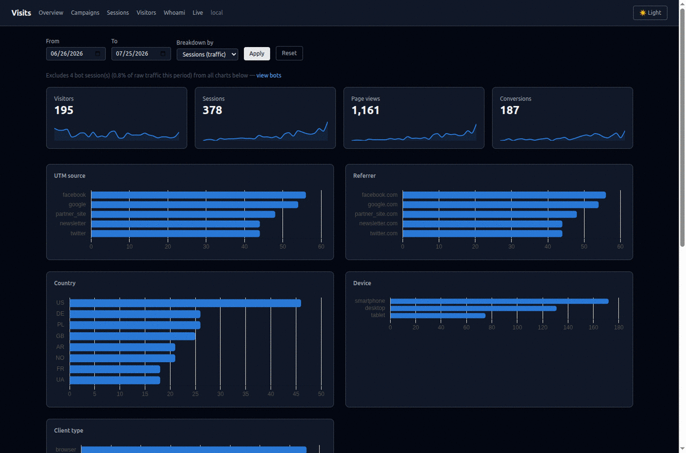

# Laravel Visits

[](https://packagist.org/packages/fomvasss/laravel-visits)
[](https://packagist.org/packages/fomvasss/laravel-visits)
[](https://packagist.org/packages/fomvasss/laravel-visits)

Self-hosted, first-party analytics for Laravel: visitor, session and page-view tracking, geo/device/bot detection, campaign attribution, conversions tied to your own Eloquent models, daily rollups and a built-in dashboard with a live activity map — all in your own database.

[Українською](README.uk.md)



- **Visitor → Session → Event** — durable identity, browsing sessions, page views and custom actions instead of one flat table
- **Async-first** — the request only resolves the visitor id; geo, device detection and writes run in a queued job
- **Three entry points** — automatic page views (middleware), a JSON endpoint for the JS beacon and mobile apps, `Visits::track()` from PHP
- **Identity** — cookie, client-supplied `X-Visitor-Id`, reconnection of logged-in users on Bearer-token APIs, merge on login or `Visits::identify()`
- **Attribution** — UTM/`ref` first touch and last touch, ad click IDs, search keywords
- **Conversions on your models** — `Visits::track('order.placed', $order)` and read it back from `$order`
- **Dashboard** — Overview with a session map, Campaigns, Sessions, Visitors, Live map, Whoami
- **Events** for every visit, conversion, new visitor, new session and identified user

## Requirements

- PHP ^8.3
- Laravel ^12 | ^13
- A queue worker and the scheduler

## Installation

```bash
composer require fomvasss/laravel-visits
php artisan migrate

php artisan vendor:publish --tag=visits-config # optional
php artisan vendor:publish --tag=visits-assets # optional, JS beacon
```

> **Security:** the dashboard at `/visits` is open to anyone by default. Set `dashboard.middleware` to e.g. `['web', 'auth']` before deploying.

## Quick start

Every `GET` request through the `web` middleware group is now tracked; the dashboard is at `/visits`.

```php
use Fomvasss\Visits\Concerns\HasVisits;

class Order extends Model
{
    use HasVisits;
}
```

```php
use Fomvasss\Visits\Facades\Visits;

Visits::track('order.placed', $order, ['amount' => $order->total]);

// payment webhook: no cookie, take the visitor from the earlier event
Visits::track('order.paid', $order, inheritFrom: 'order.placed');

$order->latestVisitEvent('order.placed')->first()?->session->utm_source;
```

```html
<script src="/vendor/visits/visits.js"></script>
<script>
    Visits.track('newsletter.subscribed', { plan: 'pro' });
</script>
```

## Documentation

Online: **https://fomvasss.github.io/laravel-visits/** — the same pages as in [docs/](docs/index.md).

- [Installation](docs/installation.md) · [Configuration](docs/configuration.md)
- [How tracking works](docs/usage/how-it-works.md) · [Page views](docs/usage/page-views.md) · [Custom events](docs/usage/custom-events.md) · [JS beacon](docs/usage/js-beacon.md)
- [Visitor identity](docs/usage/identity.md) · [Reading data back](docs/usage/reading-data.md) · [Campaign attribution](docs/usage/attribution.md) · [Geo & device](docs/usage/geo-device.md)
- [Consent](docs/usage/consent.md) · [Custom models & multi-tenancy](docs/usage/customization.md) · [Dashboard](docs/usage/dashboard.md) · [Whoami](docs/usage/whoami.md) · [Rollups & retention](docs/usage/maintenance.md)
- Guides: [Production checklist](docs/guides/production.md) · [Client integration](docs/guides/client-integration.md) · [Security](docs/guides/security.md) · [When to use](docs/guides/comparison.md) · [Architecture](docs/guides/architecture.md)
- Reference: [Facade](docs/reference/facade.md) · [Models](docs/reference/models.md) · [Database](docs/reference/database.md) · [Routes](docs/reference/routes.md) · [JavaScript](docs/reference/javascript.md) · [Events](docs/reference/events.md) · [Commands](docs/reference/commands.md) · [Contracts](docs/reference/contracts.md)
- [Upgrading](docs/upgrading.md) · [Changelog](CHANGELOG.md)

## Testing

```bash
composer test
```

## License

MIT — see [LICENSE](LICENSE.md).

## Support

If this package is useful to you, consider supporting its development:

[](https://send.monobank.ua/jar/5xsqtHvVrY)
[](https://ko-fi.com/fomvasss)
[](https://link.trustwallet.com/send?coin=195&address=THLgp6DxiAtbNHvgnKV56vk1L38UuUagKf&token_id=TR7NHqjeKQxGTCi8q8ZY4pL8otSzgjLj6t)

> USDT TRC20: `THLgp6DxiAtbNHvgnKV56vk1L38UuUagKf`
