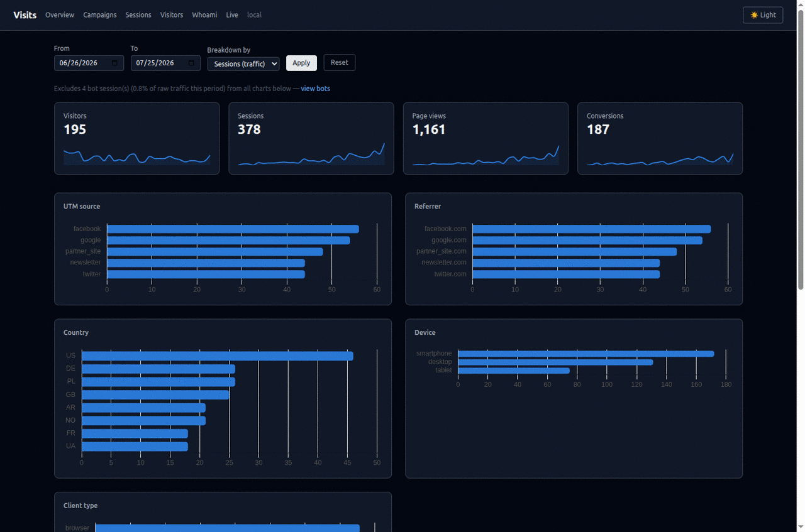
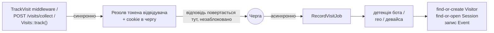

# Laravel Visits

[](https://packagist.org/packages/fomvasss/laravel-visits)
[](https://packagist.org/packages/fomvasss/laravel-visits)
[](https://packagist.org/packages/fomvasss/laravel-visits)

Self-hosted, first-party аналітична платформа для Laravel — не просто лог переглядів сторінок: трекінг відвідувачів/сесій/подій, гео/девайс/бот-детекція, атрибуція кампаній, конверсії, прив'язані напряму до твоїх Eloquent-моделей, rollup-аналітика та повноцінний дашборд з картою активності в реальному часі — все у твоїй власній БД.

[English documentation](README.md)



## Зміст

- [Можливості](#можливості)
- [Вимоги](#вимоги)
- [Встановлення](#встановлення)
- [Швидкий старт](#швидкий-старт)
- [Як це працює](#як-це-працює)
- [Трекінг](#трекінг)
  - [Кастомні дії (серверні)](#кастомні-дії-серверні)
  - [JS beacon](#js-beacon)
  - [Резолюція ідентичності](#резолюція-ідентичності)
  - [Ідентифікація відвідувача без реального логіну](#ідентифікація-відвідувача-без-реального-логіну)
- [Tracking Params](#tracking-params)
- [Гео та детекція девайса](#гео-та-детекція-девайса)
  - [Використання MaxMind-драйвера](#використання-maxmind-драйвера)
- [Згода (GDPR)](#згода-gdpr)
- [Мультитенантність](#мультитенантність)
- [Перевизначення моделей](#перевизначення-моделей)
- [Події](#події)
- [Ендпоінт Whoami](#ендпоінт-whoami)
- [Дашборд](#дашборд)
  - [Сторінка Live-активності](#сторінка-live-активності)
- [Консольні команди](#консольні-команди)
  - [Розклад (Scheduling)](#розклад-scheduling)
- [Конфігурація](#конфігурація)
- [Коли використовувати саме це (порівняно з GA4, Plausible, Matomo)](#коли-використовувати-саме-це-порівняно-з-ga4-plausible-matomo)
- [Питання безпеки](#питання-безпеки)
- [Тестування](#тестування)
- [Підтримка](#підтримка)
- [Ліцензія](#ліцензія)

## Можливості

- **Трирівнева модель даних** — Visitor (стала, крос-сесійна ідентичність) → Session (одна сесія перегляду) → Event (перегляд сторінки чи кастомна дія), замість однієї пласкої таблиці "visits".
- **Асинхронність за замовчуванням** — middleware/ендпоінт лише резолвить токен відвідувача і ставить job у чергу; вся важка робота (гео-лукап, детекція девайса/бота, записи в БД) відбувається поза циклом request/response.
- **Ідентичність через cookie + client-token** — довгоживуча cookie для звичайного браузерного трафіку, з клієнтським токеном (header чи `localStorage`), що має пріоритет для cross-origin SPA та нативних/мобільних клієнтів, де cookie ненадійні.
- **Гео, девайс та бот-детекція** — через `stevebauman/location` та `matomo/device-detector`.
- **Атрибуція кампаній** — UTM/`ref` параметри (first-touch на Visitor, last-touch на Session), плюс загальний JSON-бакет `extra_params` для click ID рекламних платформ (`gclid`, `fbclid`, `msclkid`, ...).
- **Кастомні конверсійні події** — `Visits::track('order.placed', $order, ['amount' => 100])`, опційно прив'язані до будь-якої Eloquent-моделі через поліморфний зв'язок.
- **Rollup-аналітика** — команда за розкладом попередньо агрегує денну статистику по метриках/вимірах, тож дашборд ніколи не сканує сирі таблиці подій.
- **Вбудований дашборд** — Overview (з картою локацій сесій), Campaigns, Sessions, Visitors, деталі сесії/відвідувача, сторінка Live-активності (polling чи Server-Sent Events) та публічна сторінка Whoami.
- **Публічний ендпоінт Whoami** — JSON-ендпоінт у стилі `ifconfig.me` (детекція IP/гео/девайса/UTM), лише читання, без встановлення cookie — можна використовувати окремо з інших сервісів.
- **Дружній до мультитенантності** — загальна колонка `tenant_id` та хуки перевизначення на рівні моделі, без нав'язування конкретного пакета тенантності.
- **Перевизначення моделей** — кожен зв'язок і шлях запису резолвить моделі через конфіг, тож підклас `Visitor`/`Session`/`Event`/`StatDaily` (додаткові scope, зв'язки, cast'и) підхоплюється всюди автоматично.
- **Хук згоди у стилі GDPR** — опційний resolver-інтерфейс блокує трекінг до підтвердження згоди.

## Вимоги

- PHP ^8.3
- Laravel ^12.0 або ^13.0
- Налаштоване з'єднання черги (трекінг за замовчуванням диспатчиться в чергу — див. ключ `queue` у [Конфігурації](#конфігурація))

## Встановлення

```bash
composer require fomvasss/laravel-visits
php artisan migrate
```

Сервіс-провайдер підключається автоматично (auto-discovery). Middleware трекінгу додається в групу `web` автоматично — вручну реєструвати нічого не треба.

Публікуй конфіг-файл, щоб налаштувати будь-що (назва cookie, rate limits, виключені шляхи, шлях/middleware дашборду, транспорт Live-сторінки, ...):

```bash
php artisan vendor:publish --tag=visits-config
```

Опційно опублікуй JS beacon (потрібен лише для трекінгу SPA-роутів чи клієнтських кастомних подій — див. [JS beacon](#js-beacon)):

```bash
php artisan vendor:publish --tag=visits-assets
```

## Швидкий старт

Це все, що треба для автоматичного трекінгу переглядів сторінок — кожен `GET`-запит через middleware-групу `web` уже трекається. Відкрий `/visits`, щоб побачити дашборд.

Щоб затрекати кастомну конверсію із серверного коду:

```php
use Fomvasss\Visits\Facades\Visits;

Visits::track('order.placed', $order, ['amount' => $order->total]);
```

Щоб перевірити, що пакет зараз бачить про запит, нічого не трекаючи:

```php
Visits::whoami(); // ['ip' => ..., 'geo' => ..., 'device' => ..., 'tracking_params' => ...]
```

або звернутись до публічного JSON-ендпоінту `GET /visits/whoami`.

## Як це працює

```
Visitor  (один рядок на браузер/пристрій, назавжди — стала ідентичність)
  └─ Session  (один рядок на сесію перегляду, закривається після неактивності)
       └─ Event  (один рядок на перегляд сторінки чи кастомну дію)
```

Запит проходить через middleware `TrackVisit` (або `POST /visits/collect`, або `Visits::track()`). Синхронно резолвиться лише токен відвідувача, і cookie ставиться в чергу на відправку — все інше (детекція бота/гео/девайса, пошук-або-створення `Visitor`, пошук-або-відкриття `Session`, запис `Event`) відбувається в `RecordVisitJob`, що диспатчиться в чергу, налаштовану через `visits.queue`. Застарілу (старшу за `session_timeout_minutes`) сесію закриває команда `visits:close-stale-sessions`, а не той запит, який інакше почав би нову.



Для глибшого, контриб'юторського погляду — точна послідовність `RecordVisitJob`, чим відрізняються три entry points, модель даних і зона відповідальності кожного Support-класу — дивись [`docs/architecture.md`](docs/architecture.md) (англійською).

## Трекінг

Який механізм використовувати — залежить від типу застосунку на іншому кінці:

- **Blade/серверно-рендерений сайт** — використовуй middleware `TrackVisit` ([нижче](#автоматичний-трекінг-переглядів)). Це відбувається автоматично: кожен `GET` — повне завантаження сторінки, тож є реальний серверний запит, на який можна повісити трекінг, без жодного додаткового коду.
- **API-бекенд за SPA чи мобільним застосунком** — middleware тут не застосовний. `GET` до API-ендпоінту (`GET /api/products`) — це фетч даних, а не перегляд сторінки, і зазвичай живе в групі `api`, якої `TrackVisit` взагалі не торкається. Трекай перегляди явно: [JS beacon](#js-beacon) (`Visits.trackPageView()`) при зміні роута для SPA, або прямий виклик `POST /visits/collect` для мобільного застосунку (див. [`docs/client-integration.md`](docs/client-integration.md)).
- **Кастомні дії/конверсії, для будь-якого з вищезгаданих** — завжди [`Visits::track()`](#кастомні-дії-серверні), викликаний саме там, де бізнес-подія реально відбувається на сервері (контролер, job, обробник вебхука) — незалежно від того, чи запит, що її спричинив, був блейд-формою, API-викликом, чи queued job без запиту взагалі.

### Автоматичний трекінг переглядів

Будь-який `GET`-запит через middleware-групу `web` трекається автоматично, окрім шляхів, що збігаються з `visits.exclude_paths` (шляхи admin/debugbar/horizon/health-check виключені за замовчуванням) — і власних шляхів дашборду/whoami пакета, які завжди виключені незалежно від `exclude_paths` (інакше перегляд `/visits` сам генерував би рядки page-view про перегляд дашборду).

Встанови `visits.auto_track` в `false`, щоб перейти з денайлисту на алоулист: `TrackVisit` більше не пушиться в групу `web` автоматично, і `exclude_paths` більше не застосовується (нема з чого виключати). Middleware й далі зареєстрований під alias `track-visits`, тож підключай його лише до тих роутів, які реально треба трекати:

```php
Route::middleware(['web', 'track-visits'])->group(function () {
    // тут трекаються тільки ці роути
});
```

Встанови `visits.page_views` в `'first_only'`, якщо тобі важлива лише атрибуція (referrer/UTM/geo/device, зафіксовані один раз) плюс власні явні виклики `Visits::track()` (логін, покупка, ...) — а не повний трейл переглядів сторінок. `TrackVisit` й далі виконується на кожен запит (оновлення cookie, свіжість `Session`/`Visitor`), просто не пише рядок `Event`, коли у відвідувача вже є cookie. Ефект той самий, що і від власного middleware "трекати лише нових відвідувачів", але без потреби його писати. `Session.page_views_count` у цьому режимі лишається 0 або 1, і дашбордні Top Pages/Live будуть відповідно рідкими — це очікувано, не баг.

### Кастомні дії (серверні)

```php
use Fomvasss\Visits\Facades\Visits;

// проста дія, без пов'язаної моделі
Visits::track('newsletter.subscribed');

// прив'язана до Eloquent-моделі (записує eventable_type/eventable_id), з додатковими метаданими
Visits::track('order.placed', $order, ['amount' => $order->total, 'currency' => 'USD']);
```

Це проходить через той самий асинхронний пайплайн, що й перегляди сторінок, прикріплюється до тієї `Session`, що зараз відкрита для резолвленого токена відвідувача, і генерує [`VisitRecorded`](#події) (і [`ConversionRecorded`](#події), коли передано `$eventable`).

#### Приклад: візит на сторінку → замовлення → підтверджена оплата

Типова e-commerce вирва, що охоплює три різні контексти запиту:

```php
// 1. Сторінка товару/каталогу — нічого писати не треба, TrackVisit сам фіксує
//    (за умови, що auto_track увімкнено, а роут не в exclude_paths).

// 2. Оформлено чекаут — це реальний запит браузера, тож поточна cookie/header
//    уже резолвить правильного відвідувача. Нічого спеціального не треба.
Visits::track('order.placed', $order, ['amount' => $order->total]);

// 3. Вебхук платіжного шлюзу, через хвилини/години/дні — server-to-server
//    виклик без cookie, без header: тут нема нічого, що ідентифікує клієнта.
//    inheritFrom бере відвідувача з уже записаної події 'order.placed' на цьому
//    ж $order (через HasVisits — дивись нижче), замість того, щоб хибно
//    прив'язати цю подію до нового "відвідувача" (платіжного шлюзу).
Visits::track('order.paid', $order, ['amount' => $order->total], inheritFrom: 'order.placed');
```

`inheritFrom` спрацьовує лише коли поточний запит не несе **жодного** сигналу ідентичності (ні header, ні cookie) — реальний запит браузера (напр. redirect-сторінка "дякуємо" після оплати) все одно матиме пріоритет над успадкованою історією, бо це реальний, поточний відвідувач. Якщо в `$order` нема події `'order.placed'`, з якої можна успадкувати (фічу додали вже після цього замовлення, наприклад) — резолвиться свіжий токен, як для будь-якого нового відвідувача, без помилки.

**JS-варіант кроку 3**, якщо платіжний шлюз редиректить браузер на сторінку "дякуємо" замість (чи поряд із) server-to-server вебхуком — це реальний, живий візит, тож він уже несе cookie/`localStorage`-токен самого відвідувача; жоден `inheritFrom` не потрібен:

```js
Visits.track('order.paid', { order_id: {{ $order->id }}, amount: {{ $order->total }} });
```

Дві речі, які тут втрачаються порівняно з серверним викликом вище: неможливо прикріпити `eventable` (`POST /visits/collect` не має такого поля — передай те, що ідентифікує замовлення, в `meta`, як показано), і це залежить від того, чи браузер реально дійде до цієї сторінки (закрита вкладка, заблокований скрипт, покинутий редирект — усе це означає, що подія не спрацює взагалі). Сприймай це як додатковий/ранній сигнал, не заміну вебхука — вебхук це те, що платіжний шлюз гарантовано викличе; редирект браузера не гарантований нічим.

### JS beacon

Для зміни роутів SPA та клієнтських кастомних подій, які серверний middleware не бачить. Без білд-кроку — підключай напряму, або через `vendor:publish --tag=visits-assets`:

```html
<script>
  window.VisitsConfig = { endpoint: '/visits/collect', autoTrackPageView: true };
</script>
<script src="/vendor/visits/visits.js"></script>
```

```js
Visits.trackPageView(); // виклич вручну при зміні роута SPA, якщо autoTrackPageView вимкнено
Visits.track('newsletter.subscribed', { plan: 'pro' });
```

Beacon зберігає `visitor_id` у `localStorage` (мовчки не спрацьовує, якщо недоступний) і шле його як `X-Visitor-Id`, що має пріоритет над cookie на сервері — саме це дозволяє йому працювати між origin'ами, де cookie ненадійні.

Якщо хочеш чергувати виклики так, як працює `dataLayer` у GTM (наприклад, завантажуючи `visits.js` з `async`, чи викликаючи події з inline `<script>` раніше в `<head>`, ще до того, як beacon встигне запуститись), пуш масив-виклики в `window.VisitsQueue` замість цього — безпечно як до, так і після завантаження скрипта:

```html
<script>
  window.VisitsQueue = window.VisitsQueue || [];
  window.VisitsQueue.push(['trackPageView']);
  window.VisitsQueue.push(['track', 'newsletter.subscribed', { plan: 'pro' }]);
</script>
<script src="/vendor/visits/visits.js" async></script>
```

### За межами same-origin Blade-застосунку

Беакон опційний — `POST /visits/collect` це звичайний JSON-ендпоінт, який можна викликати напряму будь-яким HTTP-клієнтом. Для API-only бекенду, окремого SPA/мобільного застосунку, бекенду, що обслуговує і веб-застосунок, і API одночасно, чи фронтенду на іншому домені, ніж API — див. [`docs/client-integration.md`](docs/client-integration.md), що саме треба відтворити самому, та специфіку конфігу/CORS/CSRF для кожного з цих випадків.

### Резолюція ідентичності

Пріоритет при резолюції токена відвідувача на кожному запиті: клієнтський токен (header `X-Visitor-Id` чи input `visitor_id`) → наявна cookie → `inheritFrom` з `Visits::track()`, якщо переданий → власний відомий `Visitor` автентифікованого запиту, якщо є → щойно згенерований. Cookie (`visits.cookie.name`, TTL 2 роки за замовчуванням) (пере)ставиться в чергу на кожному затрекованому запиті незалежно від того, який шлях резолвив токен.

**Fallback через автентифікованого юзера важливий саме для Bearer-token API.** Cookie повертається назад лише якщо браузер готовий її відправити — на same-origin завжди, на cross-origin лише з `credentials: include` **і** CORS-конфігом API, що дозволяє credentials (`supports_credentials: true`, не wildcard-origin). Типовий Sanctum personal-access-token API (`Authorization: Bearer ...`, без CORS credentials) взагалі ніколи не отримає cookie від пакету назад — без цього fallback'у кожен серверний виклик `Visits::track()` для вже відомого залогіненого юзера (покупка, оновлення профілю) породжував би новий, ізольований анонімний `Visitor` замість того, щоб з'єднатись із уже наявним. Якщо твоя auth-модель використовує [`HasVisits`](#привязка-visits-до-власних-моделей) — це відбувається автоматично, без жодного додаткового коду чи параметра. Не з'єднається так лише найперший анонімний дотик (до того, як хоч якийсь `Visitor` уже прив'язаний до цього юзера) — так само, як у будь-якій системі атрибуції.

### Ідентифікація відвідувача без реального логіну

`Visits::identify($user)` прив'язує `Visitor` поточного запиту до `$user` — той самий merge, що робить `MergeVisitorIdentity` на власній Laravel-події `Login`, але для ідентичності, встановленої **без** реальної автентифікації. Типовий кейс — гостьовий checkout, де телефон/email з форми матчить чи створює `User`-запис без пароля, OTP чи сесії взагалі.

```php
// напр. всередині Action гостьового checkout, одразу після матчу/створення гостьового User
Visits::identify($user);
```

**Не роби це через диспатч фейкової події `Login`** (`event(new \Illuminate\Auth\Events\Login(...))`) — спокуса зрозуміла, бо саме на неї слухає `MergeVisitorIdentity`, але це введе в оману будь-який **інший** listener на `Login`, доданий пізніше (нотифікація "новий вхід", перевірка на шахрайство, скидання лічильника невдалих спроб...) — вони спрацюють на звичайну відправку форми, яка ніколи не була логіном. `Visits::identify()` робить той самий merge — резолв токена з того самого запиту, оновлення `Visitor.user_id/user_type`, диспатч `VisitorIdentified`, immutable-знімок `Session`, якщо вона ще відкрита в межах `session_timeout_minutes` — без жодного дотику до події `Login`. Диспатч самої `Login` лиши для випадків, де реальна автентифікація таки відбулась, просто через код, що не викликає `Auth::login()`/`Auth::attempt()` (наприклад, Sanctum-токен, виданий напряму після перевірки пароля/OTP) — там це чесно, не запозичено.

### Прив'язка visits до власних моделей

Додай трейт `HasVisits` до будь-якої моделі, яку передаєш у `Visits::track($name, $model)` (`Order`, `Lead`, `User`, ...):

```php
use Fomvasss\Visits\Concerns\HasVisits;

class Order extends Model
{
    use HasVisits;
}

$order->visitEvents; // кожен Event, прив'язаний до цієї моделі через eventable
$order->latestVisitEvent('order.shipped')->first(); // останній Event з цією назвою, або null
```

#### Читання даних з eventable-моделі (напр. `Order`)

Кожен `Event` несе власні `visitor`/`session`, тож можна перейти від бізнес-запису напряму до того, **як** і **звідки** це сталося, а не лише факту, що сталося:

```php
$event = $order->latestVisitEvent('order.placed')->first();

$event->meta;                  // ['amount' => 100, 'currency' => 'USD'] — те, що передав у Visits::track()
$event->visitor;               // Visitor — стала ідентичність, на всіх сесіях, що коли-небудь були
$event->session;               // Session — конкретна сесія перегляду, в якій сталося це замовлення
$event->session->utm_source;   // атрибуція саме ЦЬОГО замовлення (last-touch на Session)
$event->session->country_code; // гео на момент цього замовлення
$event->session->device_type;  // девайс, з якого його оформили

// Усі етапи вирви цього замовлення, якщо трекаєш на нього більше однієї назви
$order->visitEvents()->pluck('name', 'created_at'); // напр. ['order.placed' => ..., 'order.paid' => ..., 'order.shipped' => ...]
$order->latestVisitEvent('order.paid')->first();
```

#### Читання даних з auth-моделі (напр. `User`)

На моделі `User` (чи якою б не була твоя auth-модель) той самий трейт додатково дає:

```php
$user->visitorProfiles; // кожен Visitor, коли-небудь пов'язаний з цим юзером, на всіх його пристроях/браузерах

$user->visitorProfiles->count();                              // скільки різних пристроїв/браузерів він використовував залогінений
$user->visitorProfiles->sortByDesc('last_seen_at')->first();  // його найостанніше активний пристрій
$user->visitorProfiles->pluck('utm_source', 'id');            // канал залучення (first-touch) по кожному пристрою

// усі Event на всіх пристроях, якими коли-небудь користувався цей юзер, напр. усі його конверсії
$user->visitorProfiles->flatMap->events;
$user->visitorProfiles->flatMap->events->where('type', \Fomvasss\Visits\Models\Event::TYPE_ACTION);
```

`Visitor` пов'язується з `User` лише з моменту логіну на цьому пристрої (див. [`VisitorIdentified`](#події), генерується на власній події Laravel `Login`) — анонімний перегляд до першого логіну на конкретному пристрої й далі лишається в рядках `Visitor`/`Session`, просто недоступний через `$user->visitorProfiles`, поки зв'язок не з'явився.

## Tracking Params

Query-параметри розділені трьома способами (`config('visits.tracking_params')`):

- **core** — `utm_source`, `utm_medium`, `utm_campaign`, `utm_term`, `utm_content`, `ref`. Реальні, індексовані колонки. First-touch (записується один раз) на `Visitor`, last-touch (перезаписується, якщо присутній, інакше успадковується) на `Session`.
- **extra_keys** — завжди захоплюються в JSON-бакет `extra_params`: click ID рекламних платформ (`gclid`, `fbclid`, `msclkid`, `ttclid`, `yclid`, `twclid`, `li_fat_id` за замовчуванням) — висока кардинальність, не варто окремої колонки на кожен, але варто зберігати, щоб мати змогу відправити ID назад у conversion API тієї платформи.
- **extra_pattern** — опційний regex; будь-який інший query-параметр, чиє *ім'я* збігається з ним, теж захоплюється в `extra_params`. За замовчуванням `null`. Приклад: `'/^aff_/'` захопить кожен параметр `aff_*` з власної афіліат-мережі.

## Гео та детекція девайса

Гео-лукапи йдуть через `stevebauman/location` (налаштуй його драйвер у своєму `config/location.php`); результати кешуються по IP на `visits.geo.cache_ttl` секунд. Встанови `visits.geo.store_coordinates` у `false`, щоб не зберігати `lat`/`lng` для privacy-чутливих деплойментів.

Детекція девайса/браузера/платформи та класифікація ботів йде через `matomo/device-detector`, що компілює свій набір правил при першому використанні і кешує його в `visits.device_detection.cache_dir`. Бот-трафік ніколи не платить за гео-лукап (перевіряється першим), і запити дашборду виключають ботів за замовчуванням (див. `ExcludesBotsByDefault` — використай `withBots()`/`onlyBots()`, щоб повернути їх у будь-якому запиті).

Обидва зберігаються і на `Visitor`, і на `Session` — але з різною семантикою: копія на `Visitor` — це *останнє відоме* значення (мутабельне, перезаписується на кожній новій сесії), на `Session` — *immutable-знімок* того, що було визначено саме на момент старту цієї конкретної сесії. Той самий поділ на core-колонки vs JSON-бакет, що й у [Tracking Params](#tracking-params) вище: поля, варті бути виміром — реальна, індексована колонка; все інше (непослідовне між драйверами, високої кардинальності, чи просто рідко запитуване) йде в JSON-бакет `geo_meta`/`device_meta` замість окремої колонки на кожне.

**Гео — core-колонки:** `country_code`, `region`, `city`, `timezone`, `lat`/`lng` (якщо `store_coordinates` не `false`). **`geo_meta` JSON:** `country_name`, `currency_code`, `region_code`, `zip_code`/`postal_code`, `metro_code`, `area_code`, `driver` (який саме драйвер `stevebauman/location` дав цей результат) — заповнюється непослідовно залежно від активного драйвера (наприклад, `IpApi` дає `zip_code`+`currency_code`, MaxMind натомість `postal_code`+`metro_code`) — саме тому жодне з цих полів не окрема колонка.

**Девайс/браузер — core-колонки:** `device_type` (desktop/smartphone/tablet/...), `client_type` (браузер/мобільний застосунок/бібліотека/feed reader/PIM/медіаплеєр — ортогонально до `is_bot`; matomo класифікує чимало такого трафіку як не-бот), `platform` (назва ОС), `browser`, `is_bot`. **`device_meta` JSON:** `device_family` (бренд, напр. Apple/Samsung), `device_model`, `platform_version` (версія ОС), `browser_version`, `browser_engine` — реальна деталізація, яку дає matomo/device-detector, але ніколи не використовується для фільтрації/групування (напр. точні номери білдів браузера), тож не варта окремої колонки на кожне.

**Деталі бота (`bot_name`, `bot_category` — напр. `Googlebot` / "Search bot") живуть лише на `Event`, не на `Visitor`/`Session`** — там лише булевий `is_bot`, бо бот-статус відвідувача не може змістовно змінюватись всередині ідентичності так, як бот-ім'я конкретного хіта.

**Також фіксується на кожному запиті, не гео/девайс, але поруч із ними:** `locale` (з `Accept-Language`, зіставлений з налаштованими локалями твого застосунку) і `browser_language` (сире, незіставлене значення заголовка) — той самий поділ core-колонка + мутабельний `Visitor`/immutable `Session`, що й вище. Все це — гео, девайс, локаль — те саме, що повертає [`GET /visits/whoami`](#ендпоінт-whoami) як живий read-only знімок для поточного запиту, зручно перевірити наживо, що саме пакет бачить для конкретного браузера/IP, без запису в БД.

### Використання MaxMind-драйвера

Драйвери `stevebauman/location` за замовчуванням роблять зовнішній HTTP-запит на кожен лукап. Для self-hosted альтернативи без зовнішніх запитів — перемкнись на локальний MaxMind (GeoLite2) драйвер:

1. Отримай безкоштовний license key на [MaxMind](https://www.maxmind.com/en/geolite2/signup) і додай у `.env`:
   ```
   MAXMIND_LICENSE_KEY=your-key-here
   ```
2. У `config/location.php` (публікується самим `stevebauman/location`, не цим пакетом — `php artisan vendor:publish --provider="Stevebauman\Location\LocationServiceProvider"`) встанови MaxMind драйвером, а HTTP-драйвер лиши як fallback:
   ```php
   'driver' => \Stevebauman\Location\Drivers\MaxMind::class,
   'fallbacks' => [
       \Stevebauman\Location\Drivers\IpApi::class,
   ],
   ```
3. Завантаж `.mmdb` базу:
   ```bash
   php artisan location:update
   ```
4. Додай директорію завантаженої бази (`database/maxmind` за замовчуванням) у `.gitignore` свого застосунку — це бінарний файл, який перезавантажується, а не комітиться.
5. GeoLite2-бази MaxMind оновлює приблизно щотижня. Плануй `location:update` періодично (наприклад, щотижня), щоб дані лишались актуальними:
   ```php
   // routes/console.php
   Schedule::command('location:update')->weekly();
   ```

## Згода (GDPR)

```php
'consent' => [
    'require_consent' => true,
    'resolver' => \App\Support\CookieConsentResolver::class,
],
```

```php
use Fomvasss\Visits\Contracts\ConsentResolverInterface;

class CookieConsentResolver implements ConsentResolverInterface
{
    public function hasConsent(Request $request): bool
    {
        return $request->cookie('cookie_consent') === 'accepted';
    }
}
```

Коли `require_consent` дорівнює `true`, middleware `TrackVisit` повністю пропускає трекінг, поки resolver не поверне `true`. Це блокує лише автоматичний middleware перегляду сторінок — `Visits::track()` і `POST /visits/collect` не блокуються, оскільки згоду зазвичай треба перевіряти ще до того, як ти вирішиш їх викликати.

## Мультитенантність

`Visitor` (і `visit_stats_daily`) мають загальну строкову колонку `tenant_id`, за замовчуванням `''` (не `null` — щоб unique/агрегаційні запити з порівнянням `tenant_id = ''` працювали надійно). Пакет ніколи не встановлює й не скоупить її сам; якщо в тебе мультитенантний застосунок, встанови її сам — наприклад, у хуку `booted()` на перевизначеній моделі `Visitor`, чи власному listener'і — і передавай `?tenant=...` на роутах дашборду, щоб фільтрувати по ній.

## Перевизначення моделей

```php
'models' => [
    'visitor' => \App\Models\Visitor::class,
    'session' => \Fomvasss\Visits\Models\Session::class,
    'event' => \Fomvasss\Visits\Models\Event::class,
    'stat_daily' => \Fomvasss\Visits\Models\StatDaily::class,
],
```

```php
class Visitor extends \Fomvasss\Visits\Models\Visitor
{
    protected static function booted(): void
    {
        static::creating(fn ($visitor) => $visitor->tenant_id = tenant()->id);
    }
}
```

Кожен внутрішній зв'язок і шлях запису резолвить моделі через `Fomvasss\Visits\Support\ModelResolver`, тож перевизначення підхоплюється послідовно всюди — включно зі зв'язками, визначеними на *інших* моделях (`Session::visitor()` повертає те, що ти налаштував для `'visitor'`, а не завжди базовий клас).

## Події

- **`VisitRecorded`** — генерується для кожного записаного `Event` (перегляд сторінки чи дія). Підпишись на неї для інтеграцій на боці хоста (пересилка конверсій у Meta CAPI, GA4, PostHog, ...) замість того, щоб пакет напряму спілкувався з цими сервісами. Несе `Event` як `$event`.
- **`ConversionRecorded`** — генерується додатково до `VisitRecorded`, коли подія — це кастомна дія, прив'язана до eventable-моделі (`Visits::track('order.placed', $order)`). Несе `Event` як `$event`.
- **`VisitorCreated`** — генерується один раз, коли токен відвідувача бачиться вперше (щойно створений рядок `Visitor`). Корисно для хуків "новий унікальний відвідувач" — синхронізація з CRM, захоплення first-touch атрибуції. Несе `Visitor` як `$visitor`.
- **`SessionStarted`** — генерується, коли відкривається нова `Session`, а не на кожній події в межах уже відкритої. Корисно для лічильників/вебхуків "активні сесії". Несе `Session` як `$session`.
- **`VisitorIdentified`** — генерується, коли анонімний `Visitor` прив'язується до реального юзера, на `Login` або через [`Visits::identify()`](#ідентифікація-відвідувача-без-реального-логіну). Корисно для мержу доreєстраційної історії в CRM-контакт саме в момент, коли ідентичність стає відомою. Несе `Visitor` як `$visitor`.

`VisitorCreated`/`SessionStarted` генеруються незалежно від бот-статусу, так само як `VisitRecorded`/`ConversionRecorded` — перевіряй `is_bot` на переданій моделі сам, якщо listener має пропускати бот-трафік.

## Ендпоінт Whoami

`GET /visits/whoami` (власний шлях/middleware, конфіг `visits.whoami.*`) повертає read-only JSON-знімок того, що пакет детектує про поточний запит — IP, гео, класифікація девайса/бота, локаль, referrer і tracking params. Нічого не записується: жодного рядка `Visitor`/`Session`/`Event`, жодної cookie. Корисно для іншого проєкту/сервісу, який хоче цю детекцію без прийняття всього трекінг-пайплайну, чи для дебагу, чому конкретний візит був/не був атрибутований так, як очікувалось.

```json
{
  "ip": "203.0.113.4",
  "visitor_id": "…",
  "user_agent": "…",
  "bot": { "is_bot": false, "bot_name": null, "bot_category": null },
  "device": { "device_type": "desktop", "platform": "Windows", "browser": "Chrome", "client_type": "browser", "...": "..." },
  "geo": { "country_code": "US", "city": "Mountain View", "lat": 37.751, "lng": -97.822, "...": "..." },
  "locale": "en",
  "referrer": null,
  "tracking_params": { "utm": { "utm_source": "google" }, "extra": {} }
}
```

`geo` дорівнює `null` (не `{}`), коли лукап зазнав невдачі — "невідомо" і "відомо, але порожньо" це різні стани. `tracking_params.utm`/`.extra` лишаються `{}`, коли відповідних query-параметрів не було, оскільки це саме по собі нормальний, змістовний стан.

Опційно передай `?ip=1.2.3.4`, щоб перевірити гео для іншого IP (девайс/локаль/tracking params все одно відображають реальний запит — немає сенсу симулювати їх для чужого девайса).

## Дашборд

Вбудований веб-інтерфейс, увімкнений за замовчуванням на `/visits` (конфіг `visits.dashboard.*` для шляху/middleware/пагінації). **Автентифікація за замовчуванням не застосовується** — додай власну (`auth`, `can:...`) через `visits.dashboard.middleware` перед деплоєм будь-де, крім local.

- **Overview** (`/visits`) — тотали + спарклайни трендів для відвідувачів/сесій/переглядів/конверсій за проміжок дат, панелі розбивки (UTM source, referrer host, країна, девайс, тип клієнта — чи за назвою конверсії), зведення по бот-трафіку, і карта локацій сесій (Leaflet, кластеризація маркерів, перемикач fullscreen).
- **Campaigns** (`/visits/campaigns`) — той самий механізм проміжку дат/розбивки, але всі UTM/`ref` виміри одразу, для заглиблення саме в атрибуцію кампаній.
- **Sessions** (`/visits/sessions`) — сортований, фільтрований (проміжок дат, країна, девайс, UTM source, IP) пагінований список; веде на деталі сесії (`/visits/sessions/{id}`) з повним сортованим таймлайном подій (дефолт — хронологічний, це власний шлях сесії, не стрічка активності).
- **Visitors** (`/visits/visitors`) — та сама ідея, один рядок на `Visitor`, з фільтром "тільки повторні" й кількістю сесій; веде на деталі відвідувача (`/visits/visitors/{id}`).
- **Live** (`/visits/live`) — недавні події як згасаючі маркери-спалахи на мапі світу, плюс таблиця-лог, що скролиться, під нею (з посиланням назад на сторінку деталей кожної сесії). Не справжній реал-тайм — події проходять через чергу, перш ніж потрапити сюди, тож спалах відображає "нещодавно оброблено", а не точну мить, коли це сталося. Дивись [Сторінку Live-активності](#сторінка-live-активності) нижче щодо вибору polling vs. SSE.
- **Whoami** (`/visits/me`) — власне представлення дашбордом даних [Whoami](#ендпоінт-whoami), з формою для перевірки іншого IP.

### "Breakdown by: Sessions vs Conversions"

Перемикач на Overview/Campaigns (`?breakdown_metric=`) змінює саме те, що́ рахують панелі розбивки, а не лише групування:

- **Sessions** рахує візити — обсяг трафіку по джерелу (UTM, referrer, країна, ...).
- **Conversions** рахує самі conversion-*події* (`Visits::track()` / `Event::TYPE_ACTION`, не `page_view`) — сесія з 2 конверсіями рахує як 2, не як "1 сесія з подіями".

Це різні одиниці виміру, тож цифри відрізняються між режимами — це очікувано, не баг. Перемикання на Conversions на Overview ще й додає панель "Conversion event" — розбивку по самій `name` дії.

### Сторінка Live-активності

`visits.live.transport` обирає, як сторінка отримує оновлення:

- **`poll`** (за замовчуванням) — браузер фетчить `/visits/live/feed` кожні `poll_interval_ms`. Працює будь-де, коштує один короткий запит на інтервал на кожну відкриту вкладку.
- **`sse`** — браузер відкриває одне довгоживуче з'єднання до `/visits/live/stream` (Server-Sent Events), і сервер пушить оновлення по мірі їх появи. Нижча затримка і жодних марних "нічого нового" запитів, але з'єднання тримає один PHP-FPM воркер на кожну відкриту вкладку впродовж `sse_max_duration` секунд (`EventSource` браузера після цього перепідключається автоматично). Вмикай, лише якщо твій хостинг може дозволити собі відкриті з'єднання (щедрий FPM-пул, чи Octane).

## Консольні команди

### `visits:aggregate`

```bash
php artisan visits:aggregate                          # сьогодні
php artisan visits:aggregate --date=yesterday
php artisan visits:aggregate --from=2026-01-01 --to=2026-01-31
```

Перераховує `visit_stats_daily` за задану дату(и): видаляє наявні рядки для цієї пари `(date, tenant_id)`, потім вставляє свіжо обчислені (ідемпотентно). Сторінки Overview/Campaigns дашборду читають лише з цієї rollup-таблиці, ніколи не сканують сирі події напряму.

### `visits:close-stale-sessions`

```bash
php artisan visits:close-stale-sessions
```

Закриває будь-яку сесію, чий `last_activity_at` старший за `visits.session_timeout_minutes`, встановлюючи `ended_at`/`duration_seconds`/`exit_url`.

### `visits:prune`

```bash
php artisan visits:prune                 # використовує visits.retention_days
php artisan visits:prune --days=180
php artisan visits:prune --force         # пропустити підтвердження
```

Видаляє сирі рядки `visit_events`/`visit_sessions`/`visit_visitors`, старші за вікно зберігання. Ніколи не запускається автоматично — підключай у власний scheduler свідомо.

### `visits:seed-demo`

```bash
php artisan visits:seed-demo --visitors=150 --days=30 --fresh --force
```

Лише для розробки/тестування (реєструється тільки в оточеннях `local`/`testing`) — генерує реалістичні ланцюжки Visitor → Session → Event з узгодженими гео/девайс/UTM даними, потім запускає `visits:aggregate` по засіяному проміжку, щоб дашборд не був порожнім. `--fresh` спершу очищає наявні таблиці `visit_*` (питає підтвердження, якщо не передано ще й `--force`).

### Розклад (Scheduling)

`visits.schedule.enabled` за замовчуванням `true` — сервіс-провайдер сам реєструє `visits:close-stale-sessions` і `visits:aggregate` на фіксованих частотах нижче — жодних правок `routes/console.php` не потрібно для свіжого інсталу. Вимкни (`VISITS_SCHEDULE_ENABLED=false`), якщо хочеш інші частоти, або вже сам запланував ці команди (лишивши в такому разі увімкнено — вони запустяться двічі).

`visits:prune` свідомо ніколи не планується автоматично, навіть з увімкненим флагом — видалення рядків завжди має бути окремим, явним рішенням:

```php
// routes/console.php
use Illuminate\Support\Facades\Schedule;

Schedule::command('visits:prune')->daily()->when(fn () => config('visits.retention_days') > 0);
```

Щоб налаштувати інші частоти замість авторегестрованих, встанови `visits.schedule.enabled` у `false` і додай їх сам:

```php
// routes/console.php
use Illuminate\Support\Facades\Schedule;

Schedule::command('visits:close-stale-sessions')->everyFiveMinutes();
Schedule::command('visits:aggregate --date=today')->everyFiveMinutes();
Schedule::command('visits:aggregate --date=yesterday')->dailyAt('00:10');
```

## Конфігурація

Повний анотований конфіг-файл — у [`config/visits.php`](config/visits.php) — опублікуй його через `vendor:publish --tag=visits-config`, щоб налаштувати. Основні групи:

| Ключ | Призначення |
|---|---|
| `enabled` | Головний перемикач для всього пакета. |
| `models` | Перевизначити `Visitor`/`Session`/`Event`/`StatDaily` власними підкласами. |
| `queue` | Назва з'єднання/черги, в яку диспатчиться `RecordVisitJob`. |
| `cookie` | Назва/TTL cookie ідентичності відвідувача. |
| `visitor_id.format_regex` | Формат, який приймається від клієнтського `X-Visitor-Id`/`visitor_id`. |
| `reset_identity_on_logout` | Скидати `Visitor.user_id` на логауті (спільні/кіоскові пристрої). |
| `session_timeout_minutes` | Вікно неактивності, перш ніж `visits:close-stale-sessions` закриє сесію. |
| `auto_track` | `false` перемикає `TrackVisit` з глобального-з-денайлистом режиму на ручне підключення (див. [Автоматичний трекінг переглядів](#автоматичний-трекінг-переглядів)). |
| `exclude_paths` | Шляхи, які middleware трекінгу ніколи не трекає (денайлист, актуальний лише коли `auto_track` — `true`). |
| `page_views` | `'first_only'` пропускає рядок `Event` для переглядів сторінок повторного відвідувача — `Session`/`Visitor` все одно оновлюються (див. [Автоматичний трекінг переглядів](#автоматичний-трекінг-переглядів)). |
| `tracking_params` | Core-колонки UTM/`ref`, `extra_keys` для click ID, опційний regex `extra_pattern`. |
| `geo` | TTL кешу гео-лукапу, чи зберігати координати. |
| `device_detection` | Директорія кешу правил `matomo/device-detector`. |
| `rate_limit` | Throttle для `/visits/collect` (`endpoint`), бюджет подій на відвідувача (`visitor_budget`), і для `/visits/whoami` (`whoami`). |
| `collect` | Middleware для `POST /visits/collect` (див. [`docs/client-integration.md`](docs/client-integration.md)), плюс опційний серверний allowlist `allowed_origins`. |
| `schedule.enabled` | Автореєстрація `visits:close-stale-sessions`/`visits:aggregate` за фіксованим розкладом (див. [Розклад](#розклад-scheduling)); увімкнено за замовчуванням. |
| `retention_days` | Вік, при якому сирі рядки стають доступні для `visits:prune`. |
| `aggregate.dimensions` | По яких вимірах `visits:aggregate` розбиває rollups. |
| `consent` | Заблокувати трекінг за реалізацією `ConsentResolverInterface`. |
| `dashboard` | Шлях/middleware/пагінація, проміжок дат за замовчуванням, URL тайлів мапи/ліміт маркерів. |
| `live` | Live-сторінка увімк./вимк., транспорт `poll`/`sse`, інтервали, ліміт фіда. |
| `whoami` | Шлях/middleware для публічного whoami-ендпоінту. |
| `tenant_resolver` | Зарезервовано для використання хостом — пакет сам ніколи не читає й не скоупить по ньому. |
| `user_display_resolver` | Клас, що реалізує `UserDisplayNameResolverInterface`, резолвить display-ім'я для поліморфного зв'язку `user` на дашборді. |

## Коли використовувати саме це (порівняно з GA4, Plausible, Matomo)

Це не заміна GA4, і рахувати "хто скільки фіч має" було б нечесно — GA4 безкоштовний на будь-якому обсязі, має глобальну real-time інфраструктуру, ML-прогнози й глибоку інтеграцію з Google Ads, на яку маленький self-hosted пакет претендувати не може. Обирай цей пакет саме тоді, коли хочеш, щоб трекінг жив *всередині* твого застосунку, а не поруч із ним:

| | Цей пакет | GA4 | Plausible/Fathom | Matomo (self-hosted) |
|---|---|---|---|---|
| Де живуть дані | У твоїй БД | На серверах Google | На серверах вендора (hosted) | У твоїй БД |
| Прив'язка подій до власних моделей (`Order`, `Lead`, ...) через реальний Eloquent-зв'язок | Так (`eventable`) | Ні — окрема система, зв'язується вручну | Ні | Ні (окрема система) |
| Запити по візитах разом з рештою даних застосунку (один JOIN, без export/ETL) | Так | Ні | Ні | Ні |
| Вартість при великому обсязі | Безкоштовно (своя інфра) | Безкоштовно | Платно за рівень pageview | Безкоштовно (своя інфра) |
| Real-time на глобальному масштабі, ML/прогнози, синк з рекламними платформами | Ні | Так | Ні | Частково |

На практиці: якщо питання звучить як "які рядки `Order` прийшли з фейсбук-кампанії, зʼєднані з моєю ж таблицею `orders`" — це і є справжня причина існування цього пакета. Якщо питання "як росте трафік порівняно з індустрією, на масштабі Google, без жодної інфраструктури для підтримки" — це GA4, і цей пакет тут конкурувати не намагається. Ніщо не заважає використовувати обидва одночасно — вони відповідають на різні питання.

## Питання безпеки

Дещо з цього притаманне будь-якому клієнтському аналітичному beacon (те саме стосується і власного collect-ендпоінту GA4), не є унікальним для цього пакета — перелічено тут, щоб це був свідомий, поінформований вибір, а не сюрприз.

- **`visitor_id` — це bearer-токен, не підписаний credential.** `X-Visitor-Id`/`visitor_id` перевіряється лише на формат (`TokenResolver::isValidFormat()`), ніколи на автентичність. Будь-хто, хто отримає чужий токен (XSS, витік у referrer/логах), може записувати події від імені цієї ідентичності. Вплив обмежений підміною *анонімної трекінг*-ідентичності — `Visitor.user_id` встановлюється з власної події `Login` Laravel, не з цього токена, тож це не можна використати для імітації автентифікованого акаунту.
- **Cookie — `httpOnly`; копія в `localStorage` — ні.** `Cookie::queue()` у Laravel за замовчуванням `httpOnly`, тож сама cookie стійка до випадкових XSS-читань — але `visits.js` навмисно зберігає той самий токен у `localStorage` (читається будь-яким JS на сторінці), оскільки саме це й уможливлює cross-origin/SPA використання взагалі. XSS будь-де на сторінці може прочитати його в обох випадках.
- **Клієнтські дані не верифікуються.** `POST /visits/collect` (і все, що доходить до `Visits::track()` з клієнтського вводу) приймає будь-який `type`/`name`/`meta`/`url`, що надішле викликач — нічого не підтверджує, що заявлений перегляд сторінки чи конверсія реально сталися. `rate_limit.endpoint`/`visitor_budget` обмежують обсяг, не автентичність. `collect.allowed_origins` (див. [`docs/client-integration.md`](docs/client-integration.md)) фільтрує запити за `Origin`/`Referer`, але обидва контролюються атакуючим — сприймай це як фільтр для випадкових зловживань, не автентифікацію.
- **Немає ключа ідемпотентності на кастомних діях.** Клієнтський retry (наприклад, власна логіка повторів мобільного застосунку) може задвоїти той самий запис конверсії. Додай власну перевірку ідемпотентності в `meta`, якщо конкретна дія ніколи не повинна рахуватись двічі.
- **Бот-детекція (`matomo/device-detector`) — це фільтр якості даних, не засіб безпеки.** Вона базується на User-Agent і тривіально підміняється — добре для того, щоб прибрати очевидний краулерний шум з дашборду, не для блокування чогось чутливого.
- **Дашборд без автентифікації за замовчуванням.** `visits.dashboard.middleware` з коробки — `['web']` — додай власну (`auth`, `can:...`, чи свій gate) перед деплоєм будь-де, крім local.
- **`/visits/whoami` публічний, неавтентифікований, і прив'язаний лише до IP.** Тепер має власний throttle (`rate_limit.whoami`, за замовчуванням `60,1`), окремий від `rate_limit.endpoint` — зменш його (чи встанови `whoami.enabled` у `false`), якщо не хочеш, щоб він був доступний у продакшені взагалі.

## Тестування

```bash
composer test
```

## Підтримка

Якщо цей пакет корисний для тебе, розглянь можливість підтримати його розробку:

[](https://send.monobank.ua/jar/5xsqtHvVrY)
[](https://ko-fi.com/fomvasss)
[](https://link.trustwallet.com/send?coin=195&address=THLgp6DxiAtbNHvgnKV56vk1L38UuUagKf&token_id=TR7NHqjeKQxGTCi8q8ZY4pL8otSzgjLj6t)

> USDT TRC20: `THLgp6DxiAtbNHvgnKV56vk1L38UuUagKf`

## Ліцензія

MIT — див. [LICENSE](LICENSE.md).
