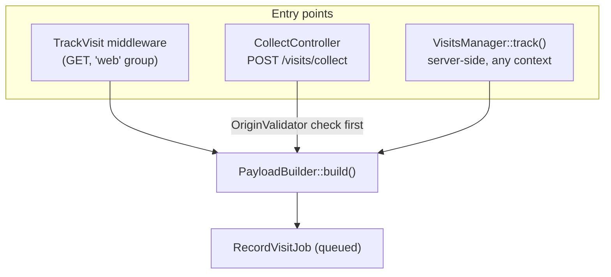
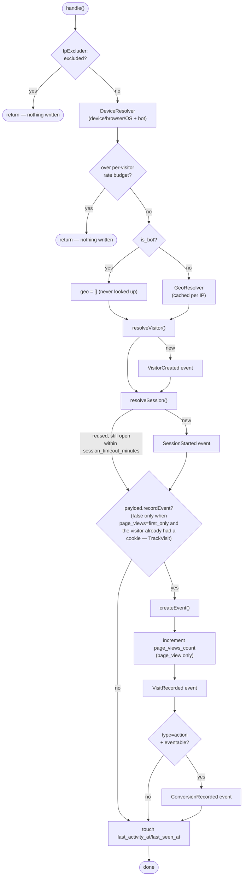
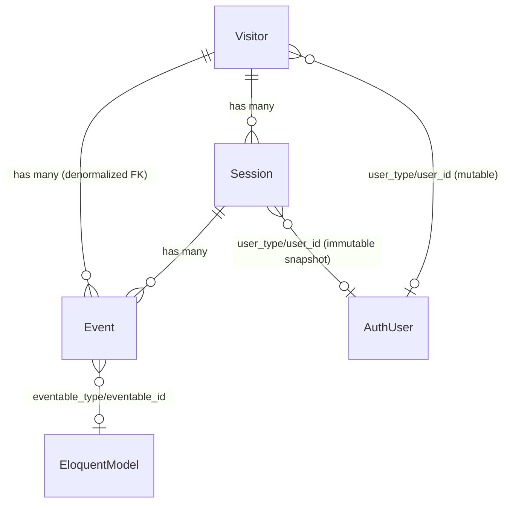

# Architecture

Internals, for anyone extending the package or reviewing/contributing to it — not needed to just use it (see the main [README](../README.md) for that). Diagrams render natively on GitHub.

## Entry points

Three ways a visit/event reaches the package, all converging on the same builder and job:

What differs between them:

| | `TrackVisit` | `CollectController` | `VisitsManager::track()` |
|---|---|---|---|
| Triggers on | Automatic, every `GET` through `web` (unless `auto_track=false`) | Client-initiated `POST` (JS beacon or raw HTTP) | Explicit call, server-side |
| `Event.type` | Always `page_view` | Client-supplied (`page_view` or `action`) | Always `action` |
| `Event.url`/`route_name` | Current request's URL/route | Client-supplied `url`; `route_name` never set (this request's own route is `visits.collect`, never the page being reported) | Current request's URL/route |
| Origin check | — | `OriginValidator` (optional `allowed_origins` allowlist) | — |
| `eventable` | — | — | Optional, any `Model` |

`PayloadBuilder::build()` is the one place all three converge: it resolves the token (`TokenResolver`), extracts UTM/`ref`/extra-params (`TrackingParamsExtractor`), the organic search keyword from the *referrer* (`SearchTermExtractor`), locale (`LocaleResolver`), and decides `url`/`route_name` from the same signal — an explicit `$url` override means "don't trust the current route, the client already told us the real page."

## `RecordVisitJob` — the async half

Everything that touches the database or an external service happens here, off the request/response cycle:

Notes that don't fit in the diagram:

- **Order is deliberate**: excluded-IP check first (cheapest, most decisive — an office/internal IP is rejected before anything else runs), bot detection before geo (so bot traffic never pays for a geo lookup), rate budget checked before the expensive writes.
- **`resolveVisitor()`** does a `firstOrNew(['token' => ...])`. Geo/device/locale fields are always overwritten (last-known, mutable). First-touch fields (`first_landing_url`, UTM, `ref`, `search_term`, `extra_params`) are only filled when the row didn't already exist — never overwritten after.
- **`resolveSession()`** reuses an open session (`ended_at IS NULL`, active within `session_timeout_minutes`) if one exists for the visitor; otherwise opens a new one. UTM/`ref`/`search_term`/`extra_params` on a *new* session are last-touch: the current request's values if present, otherwise inherited from the `Visitor`'s own first-touch values. `is_bot` is sticky per session — once true, a later non-bot-looking request in the same session never flips it back.
- **`payload.recordEvent`** (only `TrackVisit` ever sets it `false`, via `visits.page_views = 'first_only'`) skips `createEvent()` and the counters/`VisitRecorded`/`ConversionRecorded` that follow it — but `resolveVisitor()`/`resolveSession()` and the final `last_activity_at`/`last_seen_at` touch still run unconditionally, so identity/session freshness never depends on whether this request's page view actually gets an `Event` row.
- **Both `Visitor` and `Session` writes bypass `WithoutBotsScope`** (`withoutGlobalScope`) — bot traffic must still be *findable* to attach it to the right row; only dashboard/reporting queries exclude bots by default.
- Queries in `RecordVisitJob` are the only place that resolves models through `ModelResolver` for **writes**; everything downstream (dashboard, `HasVisits`) reads through the same resolver so a model override is honored everywhere.

## Data model

`StatDaily` (`visit_stats_daily`) is a separate rollup table, not part of this hierarchy — one row per `(date, metric, dimension, dimension_value, tenant_id)`, built by `visits:aggregate` from `Session`/`Event`, and read by every dashboard query *except* the ones that need a dimension too high-cardinality or too point-in-time to pre-aggregate (map markers, Top Pages, "online now", the bot-traffic summary) — those read `Session`/`Event` directly instead, capped and time-bounded.

## Support classes

| Class | Single responsibility |
|---|---|
| `TokenResolver` | Visitor identity: client header/input → cookie → `$fallback` (e.g. `inheritFrom`) → authenticated user's own known `Visitor` → generate. Format gated by `visits.visitor_id.format_regex`. `hasRequestIdentity()` (header/input/cookie only, no fallback/auth-inherit) backs `TrackVisit`'s `page_views: first_only`. |
| `PayloadBuilder` | Assembles a `VisitPayload` DTO from a `Request` — the one place shared by all three entry points. |
| `IpExcluder` | Literal IP / CIDR (IPv4+IPv6) match against `visits.exclude_ips`. |
| `DeviceResolver` | `matomo/device-detector` — device/browser/OS + bot name/category in one pass. |
| `GeoResolver` | `stevebauman/location`, wrapped with per-IP cache + graceful degradation (a failed lookup returns `[]`, never throws). |
| `SearchTermExtractor` | Organic search keyword from a known search engine's *referrer* URL (`visits.search_engines`) — distinct from `TrackingParamsExtractor` because it reads the referrer's query string, not the current request's. |
| `TrackingParamsExtractor` | UTM/`ref` core columns + `extra_params` JSON bucket (`extra_keys` allowlist, optional `extra_pattern` regex). |
| `OriginValidator` | Server-side `Origin`/`Referer` allowlist for `POST /visits/collect` (`visits.collect.allowed_origins`) — defense-in-depth, not a CORS replacement. |
| `LocaleResolver` | `locale` (matched against configured app locales) vs raw `browser_language`. |
| `ModelResolver` | Resolves `Visitor`/`Session`/`Event`/`StatDaily` through `visits.models.*`, so a subclass override is honored on every read and write. |
| `RequestInspector` | Read-only version of the same detection pipeline `RecordVisitJob` uses — powers `/visits/whoami`, writes nothing. |

## Events & listeners

| Event | Dispatched from | Carries |
|---|---|---|
| `VisitorCreated` | `RecordVisitJob` — first time a token resolves to a new `Visitor` row | `Visitor` |
| `SessionStarted` | `RecordVisitJob` — no reusable open session found | `Session` |
| `VisitRecorded` | `RecordVisitJob` — every event, page view or action | `Event` |
| `ConversionRecorded` | `RecordVisitJob` — only `type=action` with an `eventable` attached | `Event` |
| `VisitorIdentified` | `MergeVisitorIdentity` listener, on Laravel's own `Login` | `Visitor` |

Two listeners hook Laravel's own auth events, not this package's:

- **`MergeVisitorIdentity`** (on `Login`) — resolves the current request's token, sets `Visitor.user_id`/`user_type`, dispatches `VisitorIdentified`. `Session.user_id` is a separate, immutable snapshot — set once, never touched again even if the user later logs into a different account on the same device.
- **`ResetVisitorIdentity`** (on `Logout`, off by default via `visits.reset_identity_on_logout`) — clears `Visitor.user_id`/`user_type`. Opt-in only, for shared/kiosk devices; resetting on every logout would break attribution continuity for the typical single-user device.
