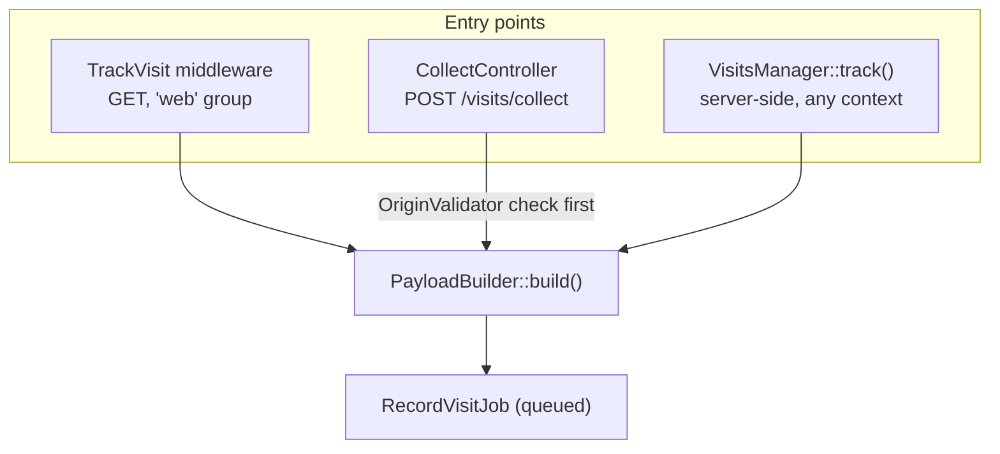
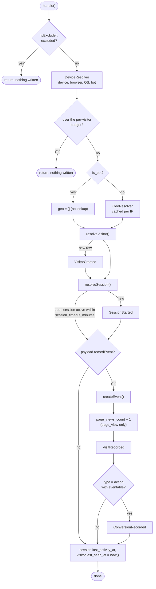
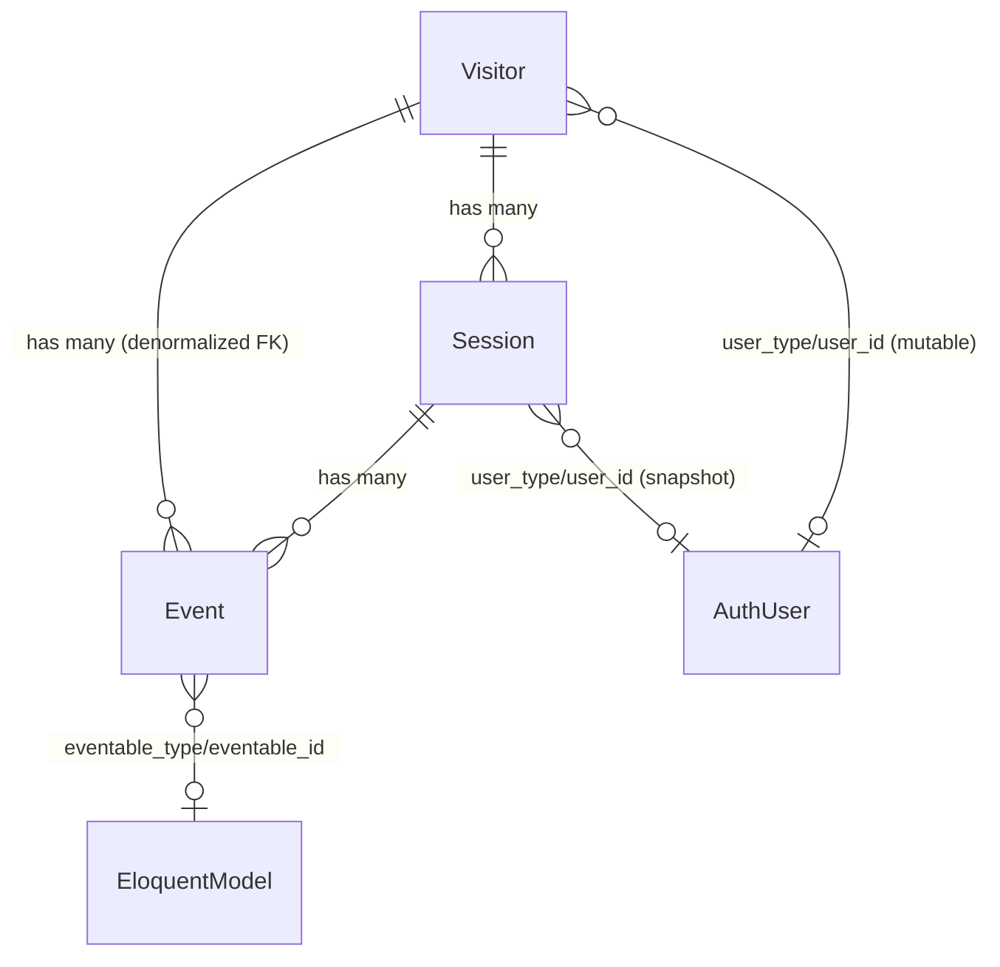

# Architecture

Internals, for anyone extending, reviewing or contributing to the package — not needed to use it.

## Entry points

Three ways a visit or event reaches the package, all converging on the same builder and job:

What differs between them:

| | `TrackVisit` | `CollectController` | `VisitsManager::track()` |
|---|---|---|---|
| Triggers on | Every tracked `GET` through `web` (or routes with the `track-visits` alias) | Client `POST` (JS beacon or raw HTTP) | Explicit call |
| `Event.type` | Always `page_view` | Client-supplied, `page_view` by default | Always `action` |
| `Event.url` / `route_name` | Current request's URL and route | Client-supplied `url`, `route_name` `null` | Current request's URL and route |
| Gates | `exclude_paths`, own routes, consent | `OriginValidator` (`allowed_origins`), validation, throttle | — |
| `eventable` | — | — | Optional, any `Model` |
| Identity fallback | — | — | `inheritFrom` |
| `recordEvent = false` | With `page_views = first_only` for a returning visitor | Never | Never |

All three resolve the visitor id with `TokenResolver`, queue the visitor cookie and dispatch `RecordVisitJob` to `visits.queue`.

`PayloadBuilder::build()` is where they converge: it captures the IP, User-Agent, referrer, the search keyword from the referrer (`SearchTermExtractor`), UTM/`ref`/extra parameters from the query string (`TrackingParamsExtractor`), locale (`LocaleResolver`), and the authenticated user's morph class and id. An explicit `$url` means "the client told us the real page" — then `route_name` is left empty, because the current route would be `visits.collect`.

## `RecordVisitJob`

Everything that touches the database or an external service happens here, off the request:

Notes:

- **Order is deliberate.** The excluded-IP check is first (cheapest and most decisive), bot detection before geo (bots never cost a lookup), the budget before any write.
- **`resolveVisitor()`** uses `createOrFirst(['token' => ...])`, so two jobs for the same new visitor racing each other (a page and its XHR, two tabs) both end up on one row instead of the loser failing on the unique index. First-touch values (`first_landing_url`, referrer, UTM/`ref`, `search_term`, `extra_params`) are only set by the insert. Device, locale and `is_bot` are overwritten on every run; geo is overwritten when the lookup returned something. If the payload has an authenticated user and the visitor has none, `user_type`/`user_id` are set to it; a visitor already linked to another user keeps that link.
- **`resolveSession()`** reuses the visitor's most recent session with `ended_at IS NULL` and `last_activity_at` within `session_timeout_minutes`; otherwise it opens a new one. A new session takes UTM/`ref` and `extra_params` from the request if present, else from the visitor's first touch; `search_term` likewise. `is_bot` is sticky per session.
- **`recordEvent = false`** skips the event, the counter and both events, but visitor and session resolution and the final touch still run.
- **Bot rows are written with `withoutGlobalScope(WithoutBotsScope::class)`** so bot traffic is still found and attached to the right rows; only reads exclude bots by default.
- Model classes come from `ModelResolver` on every read and write path, so overrides in `visits.models` are honoured everywhere. `visits:aggregate` and the Live feed query tables by name.

The job has no `tries` or `timeout` of its own — the worker's settings apply. Failures (a database error, for example) end up in `failed_jobs` like any other job.

## Data model

`StatDaily` (`visit_stats_daily`) is a separate rollup table — one row per `(date, tenant_id, metric, dimension, dimension_value)`, rebuilt by `visits:aggregate` from sessions, visitors and events. Overview and Campaigns read it. Data that is too high-cardinality or too point-in-time to pre-aggregate (the map, Top pages, "online now", the bot summary) and the Sessions/Visitors lists read the raw tables, capped and time-bounded.

## Support classes

| Class | Responsibility |
|---|---|
| `TokenResolver` | Visitor id: header/input → cookie → `$fallback` (`inheritFrom`) → authenticated user's latest visitor → generate. Format check via `visitor_id.format_regex`. `hasRequestIdentity()` (header/input/cookie only) backs `page_views = first_only`. Replaceable through `visits.token_resolver` |
| `PayloadBuilder` | Builds the `VisitPayload` DTO from a `Request` — shared by all three entry points |
| `IpExcluder` | Literal IP and CIDR (IPv4/IPv6) match against `exclude_ips` |
| `DeviceResolver` | `matomo/device-detector`: device, browser, OS, bot name and category in one pass |
| `GeoResolver` | `stevebauman/location` with a per-IP cache; a failed lookup returns `[]`, never throws |
| `SearchTermExtractor` | Search keyword from a known search engine's referrer URL |
| `TrackingParamsExtractor` | UTM/`ref` columns and the `extra_params` bucket from the query string |
| `OriginValidator` | `Origin`/`Referer` allowlist for `POST /visits/collect` |
| `LocaleResolver` | App locale and the first usable `Accept-Language` entry |
| `ModelResolver` | Model classes from `visits.models` |
| `RequestInspector` | Read-only version of the detection pipeline — powers `Visits::whoami()`, `/visits/whoami` and `/visits/me` |
| `VisitorIdentityMerger` | Links a visitor (and its open session without a user) to a user, fires `VisitorIdentified` — used by the `Login` listener and `Visits::identify()` |

## Events and listeners

| Event | Dispatched from | Carries |
|---|---|---|
| `VisitorCreated` | `RecordVisitJob` — the id resolved to a new `Visitor` row | `Visitor` |
| `SessionStarted` | `RecordVisitJob` — no reusable open session | `Session` |
| `VisitRecorded` | `RecordVisitJob` — every written event | `Event` |
| `ConversionRecorded` | `RecordVisitJob` — `type = action` with an `eventable` | `Event` |
| `VisitorIdentified` | `VisitorIdentityMerger` — `Login` or `Visits::identify()`; `RecordVisitJob` — first link of an unlinked visitor | `Visitor` |

Two listeners hook Laravel's auth events:

- **`MergeVisitorIdentity`** (`Login`) — resolves the current id and calls `VisitorIdentityMerger`: `Visitor.user_type`/`user_id` are updated, the open session gets the user if it has none, `VisitorIdentified` is dispatched. Nothing happens when no visitor row exists for the id yet.
- **`ResetVisitorIdentity`** (`Logout`, only with `reset_identity_on_logout`) — clears `Visitor.user_type`/`user_id`. Sessions keep their snapshot.

Both run synchronously in the request; they are cheap indexed updates.
