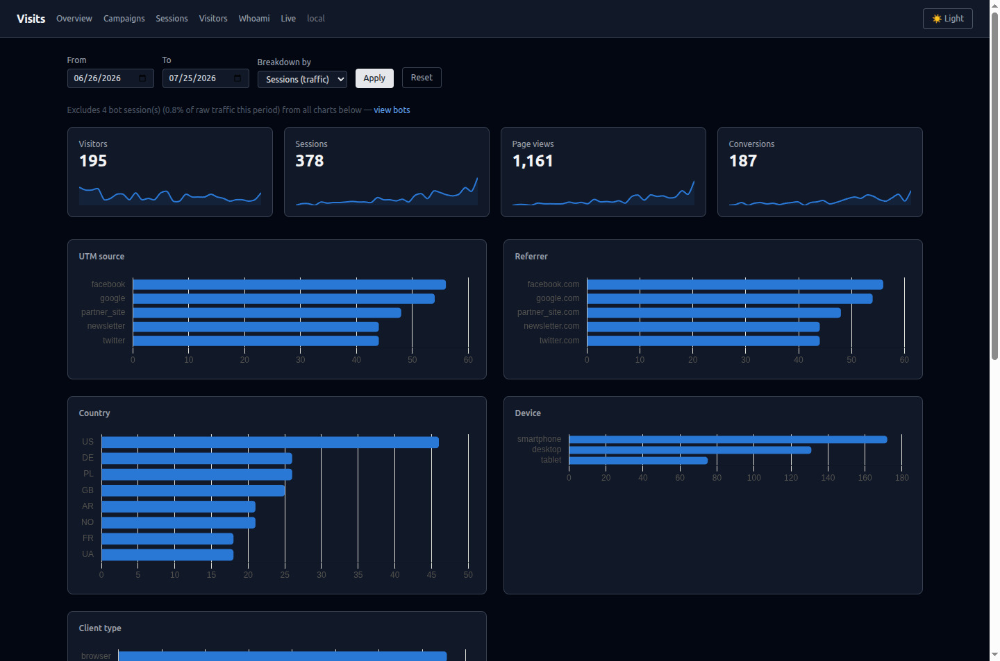
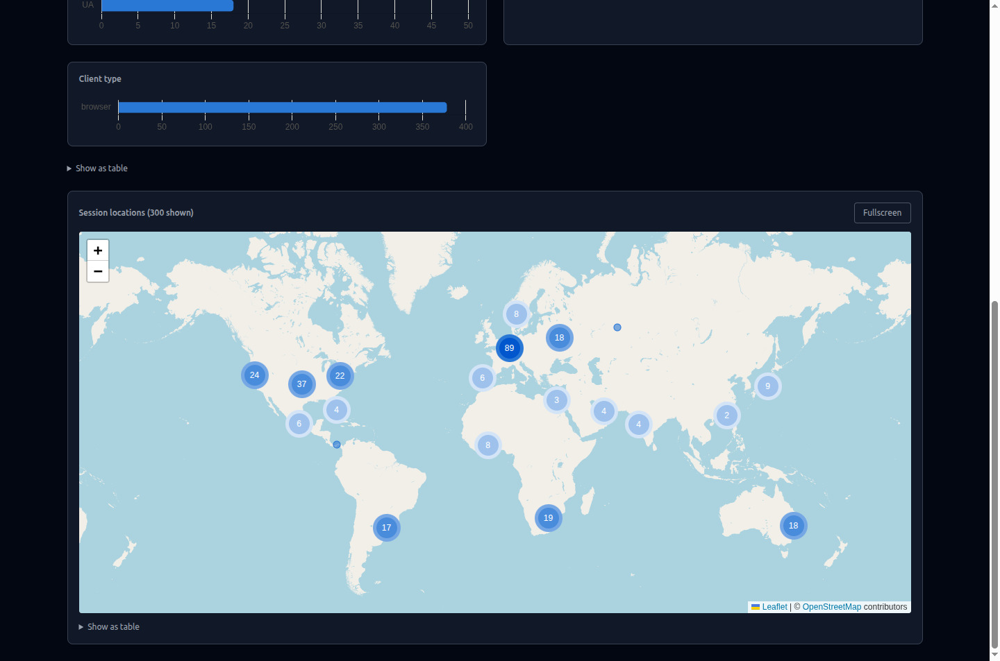
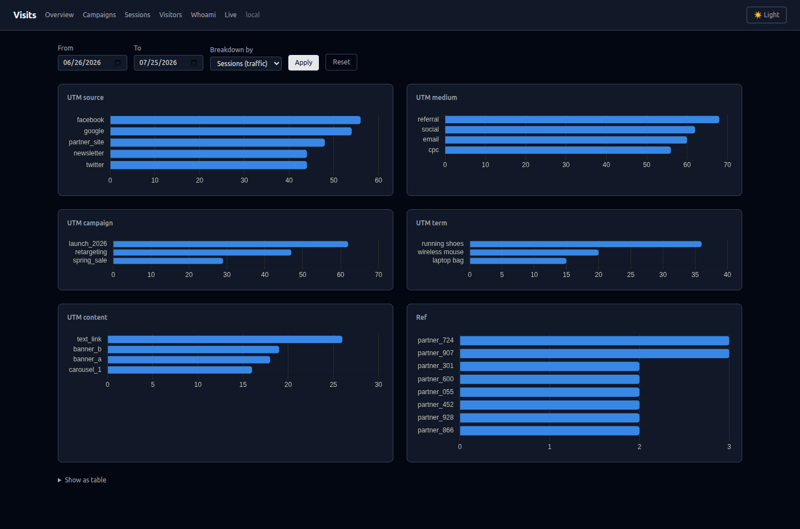
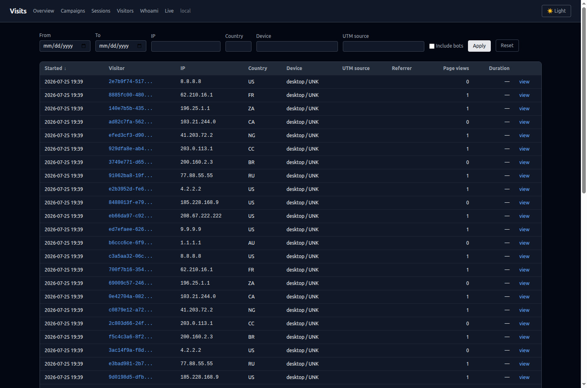
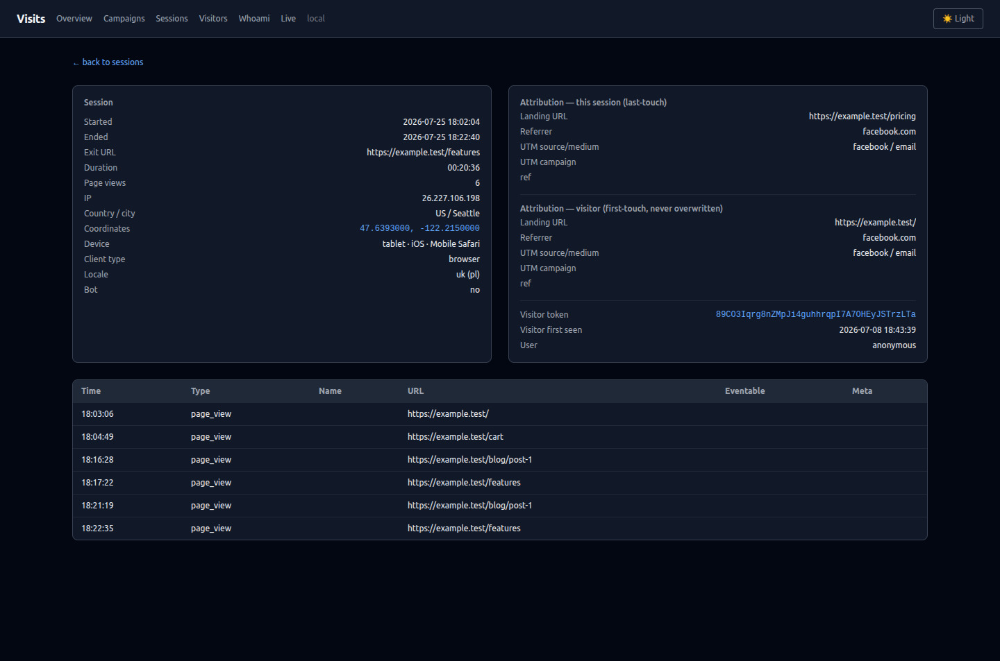
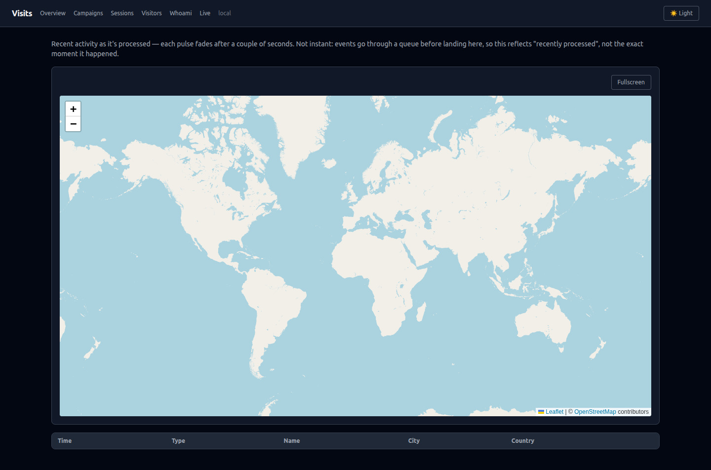

# Dashboard

A built-in UI under `/visits` (`dashboard.path`), enabled by default (`dashboard.enabled`).



## Securing the dashboard

The dashboard runs with `dashboard.middleware`, which is `['web']` — no authentication. Add your own before deploying:

```php
// config/visits.php
'dashboard' => [
    // ...
    'middleware' => ['web', 'auth', 'can:viewVisits'],
],
```

```php
// AppServiceProvider::boot()
Gate::define('viewVisits', fn ($user) => $user->is_admin);
```

The public JSON endpoint `/visits/whoami` has its own `whoami.middleware` and is not covered by this — see [Whoami](whoami.md).

The pages load Tailwind, Chart.js and Leaflet from public CDNs and map tiles from OpenStreetMap, so the browser needs internet access, and a strict Content-Security-Policy has to allow those hosts.

## Pages

| Page | URL | Route name | Data source |
|---|---|---|---|
| Overview | `/visits` | `visits.index` | Rollups (`visit_stats_daily`); map, Top pages, bot summary and "online now" from raw tables |
| Campaigns | `/visits/campaigns` | `visits.campaigns` | Rollups |
| Sessions | `/visits/sessions` | `visits.sessions` | `visit_sessions` |
| Session detail | `/visits/sessions/{id}` | `visits.show` | `visit_sessions`, `visit_events` |
| Visitors | `/visits/visitors` | `visits.visitors` | `visit_visitors` |
| Visitor detail | `/visits/visitors/{id}` | `visits.visitor` | `visit_visitors`, `visit_sessions` |
| Whoami | `/visits/me` | `visits.me` | Live detection, nothing stored |
| Live | `/visits/live` | `visits.live` | `visit_events` joined with `visit_sessions` |

### Overview

- **Online now** — open sessions active within `dashboard.online_window_minutes`, independent of the date range
- **Totals with sparklines** — visitors, sessions, page views, conversions for the range (default: the last `dashboard.default_range_days` days, or `?from=`/`?to=`). *Visitors* counts **new** visitors (by `first_seen_at`); sessions, page views and conversions count everything in the range
- **Breakdown panels** — UTM source, referrer host, country, device, client type; top 8 values each, with a table view
- **Bot summary** — how many sessions in the range were bots, with a link to the Sessions list including bots
- **Session locations** — up to `dashboard.map_marker_limit` most recent sessions with coordinates, clustered, with a fullscreen toggle
- **Top pages** — page views grouped by path (query string removed), `dashboard.top_pages_limit` rows



### Sessions vs Conversions

The *Breakdown by* selector (`?breakdown_metric=conversions`) on Overview and Campaigns changes what the panels count:

- **Sessions** — visits per source
- **Conversions** — `action` events per source; a session with two conversions counts twice. Overview adds a *Conversion event* panel grouped by event `name`

The units differ, so the totals of the two modes differ.

### Campaigns

The same mechanism with every attribution dimension at once: UTM source, medium, campaign, term, content and `ref`.



### Sessions and Visitors

Sortable, filterable lists with simple pagination (`dashboard.per_page`, no total count query).

- Sessions: filter by date (`started_at`), IP, country, device, UTM source, visitor (`?visitor_id=`), *Include bots*
- Visitors: filter by date (`first_seen_at`), visitor id (partial match), country, device, UTM source, *Returning only* (more than one session), *Include bots*



The session detail page shows the session, its last-touch attribution next to the visitor's first touch, and the event timeline (oldest first, sortable by time, type and name). Detail pages include bot rows.



## Live page

`/visits/live` shows recent events as fading pulses on a world map and a log table below, linking to each session.



- Only events whose session has coordinates appear — without geo (local IPs, `geo.store_coordinates = false`, a failing provider) the page stays empty
- Bots are excluded
- Events pass through the queue first: a pulse means "recently processed", not "just happened"

`live.transport` selects how the page gets updates:

- **`poll`** (default) — the browser requests `/visits/live/feed?since=...` every `live.poll_interval_ms`. Works everywhere; one short request per interval per open tab.
- **`sse`** — one long-lived Server-Sent Events connection to `/visits/live/stream`; the server checks for new events every `live.sse_check_interval` seconds and closes the stream after `live.sse_max_duration`, after which the page reconnects. Lower latency, but each open tab holds a PHP worker for the whole duration — use it only with a generous PHP-FPM pool or Octane. The response sends `X-Accel-Buffering: no` so nginx does not buffer it.

Both return at most `live.feed_limit` events per response. Turn the page off with `live.enabled = false`.

## Whoami page

`/visits/me` shows what the package detects about your own request — IP, geo, device, bot classification, locale, tracking parameters — with a form to look up another IP. See [Whoami](whoami.md).
