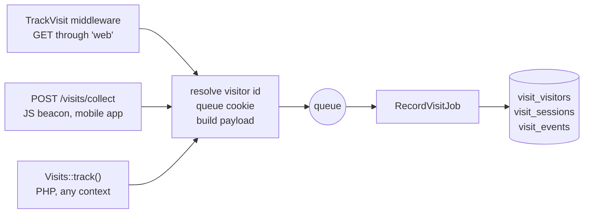

# How tracking works

## Data model

```
Visitor   one row per browser/device, ever — durable identity
  └─ Session   one browsing session, a new one after session_timeout_minutes of inactivity
       └─ Event   one page view (type page_view) or custom action (type action)
```

| Model | Table | What it holds |
|---|---|---|
| `Visitor` | `visit_visitors` | Visitor id (`token`), first-touch attribution, last-known geo/device/locale, linked user |
| `Session` | `visit_sessions` | Landing/exit URL, referrer, last-touch attribution, IP, a snapshot of geo/device at session start, page view count, duration |
| `Event` | `visit_events` | `type`, `name`, URL/path/route name, bot name, optional `eventable` model, `meta` JSON |
| `StatDaily` | `visit_stats_daily` | Daily counts per metric and dimension, built by `visits:aggregate` for the dashboard |

Two rules repeat across the columns:

- **Visitor = first touch or last known, Session = snapshot.** UTM/`ref`, `search_term`, `extra_params` and the landing/referrer URL on the visitor are written once, when the visitor row is created. Geo, device and locale on the visitor are overwritten with the latest values. A session stores what was true when it started.
- **Real columns for what you filter by, JSON for the rest.** `utm_source`, `country_code`, `device_type`, `browser` and similar are indexed columns; driver-specific geo fields, browser versions and ad click IDs go to `geo_meta`, `device_meta` and `extra_params`.

Full column list: [Database tables](../reference/database.md).

## Request flow

Three entry points build the same payload and dispatch the same job:



During the request only cheap work happens: the visitor id is resolved (or generated), the cookie is queued on the response, the query string, referrer, locale and authenticated user are captured into a `VisitPayload`, and `RecordVisitJob` is dispatched to `visits.queue`.

Everything else runs in the job, in this order:

1. IP in `exclude_ips` — stop, nothing is written
2. Device and bot detection from the User-Agent
3. Per-visitor budget (`rate_limit.visitor_budget`) exceeded — stop, nothing is written
4. Geo lookup for the IP, skipped for bots, cached per IP
5. Find or create the `Visitor` by id — fires `VisitorCreated` for a new one
6. Reuse the visitor's open session if it was active within `session_timeout_minutes`, otherwise open a new one — fires `SessionStarted`
7. Write the `Event` (unless `page_views` is `first_only` and this is a returning visitor's page view), increment `page_views_count` for page views, fire `VisitRecorded`, and `ConversionRecorded` for an action with an `eventable` model
8. Update `last_activity_at` on the session and `last_seen_at` on the visitor

A step-by-step diagram of the job is in [Architecture](../guides/architecture.md).

## What this means in practice

- **Nothing appears without a queue worker.** With a lagging queue the dashboard lags by the same amount.
- **Timestamps are processing times.** `created_at`, `started_at` and `last_activity_at` are set when the job runs, not when the request arrived. A queue backlog shifts them, and the dashboard shows events at the time they were processed.
- **Sessions are opened by events, closed by a command.** A new event after the timeout opens a new session right away; the old one keeps `ended_at = null` until `visits:close-stale-sessions` sets `ended_at`, `duration_seconds` and `exit_url`.
- **Attribution is decided when a session opens.** UTM parameters on a later page of an already open session are not written anywhere — neither the session (already open) nor the visitor (first touch only).
- **Bots are recorded, then hidden.** `is_bot` is stored on every row; the models exclude bots from queries by default (`withBots()`/`onlyBots()` to include them). Once a session has seen a bot request it stays `is_bot = true`.
- **The dashboard totals come from rollups.** Overview and Campaigns read `visit_stats_daily`, refreshed by `visits:aggregate` every five minutes by default — see [Rollups, sessions & retention](maintenance.md).
